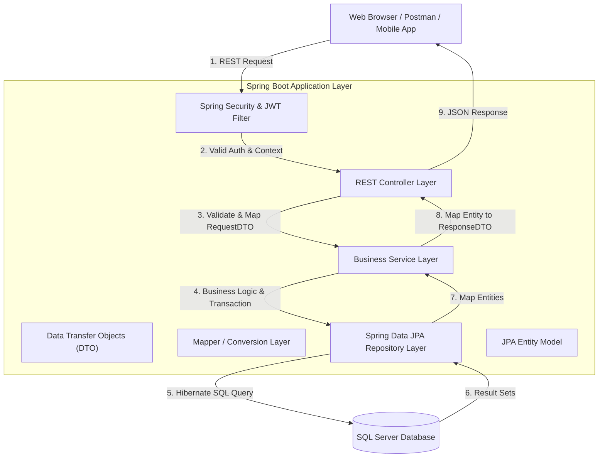

# Tài liệu Thiết kế Kiến trúc Phần mềm (Software Architecture Design Document)
**Dự án:** Hotel Booking System
**Phiên bản:** 1.0.0 | **Ngày cập nhật:** 2026-06-22
**Mô hình phát triển:** Specification-Driven Development (SDD)

Tài liệu này đặc tả chi tiết kiến trúc phần mềm, cấu trúc thư mục, luồng vòng đời dữ liệu (Request-Response Lifecycle) và các quyết định thiết kế bảo mật của hệ thống Đặt phòng Khách sạn (Hotel Booking System).

---

## 1. Mô hình Kiến trúc Phân tầng (N-Tier Architecture)

Hệ thống được thiết kế theo mô hình kiến trúc phân tầng truyền thống (N-Tier / Layered Architecture) nhằm tách biệt các mối quan tâm (Separation of Concerns), tăng cường khả năng bảo trì và kiểm thử độc lập.



### Đặc điểm phân lớp & Ràng buộc giao tiếp

1. **Lớp Giao diện API (REST Controller Layer):**
   - Đảm nhiệm cấu hình API Endpoints, kiểm soát định dạng JSON truyền lên.
   - Nhận nhiệm vụ **xác thực dữ liệu thô (Input Validation)** thông qua Jakarta Bean Validation (`@Valid`, `@NotNull`, `@Size`...).
   - **Ràng buộc:** Tuyệt đối không chứa bất kỳ logic nghiệp vụ nào (chỉ gọi Service xử lý và trả về ResponseEntity).
2. **Lớp Nghiệp vụ (Business Service Layer):**
   - Trực tiếp xử lý toàn bộ logic nghiệp vụ (ví dụ: kiểm tra trùng lịch đặt phòng, tính toán voucher, thực hiện trừ số lượt dùng của voucher).
   - Quản lý phạm vi giao dịch cơ sở dữ liệu thông qua annotation `@Transactional`.
   - **Ràng buộc:** Lớp Service nhận tham số đầu vào là các DTO và trả về DTO. Chỉ Service được phép tương tác trực tiếp với các Repositories.
3. **Lớp Truy xuất Dữ liệu (Repository Layer):**
   - Sử dụng Spring Data JPA cung cấp giao diện tương tác với cơ sở dữ liệu thông qua các phương thức được định nghĩa sẵn hoặc truy vấn tùy chỉnh (`@Query` JPQL/Native SQL).
4. **Lớp Mô hình Thực thể (JPA Entity Model):**
   - Ánh xạ trực tiếp 1-1 với cấu trúc bảng dưới cơ sở dữ liệu sử dụng các annotation của Jakarta Persistence.
   - **Ràng buộc:** Tuyệt đối không trả thực thể Entity trực tiếp qua REST Endpoints để tránh rò rỉ cấu trúc DB hoặc lỗi tải chậm (LazyLoadingException). Phải ánh xạ thực thể thành Response DTO trước khi trả về.

---

## 2. Cấu trúc thư mục Mã nguồn (Package Structure)

Cấu trúc mã nguồn của hệ thống được tổ chức nhất quán theo chức năng kỹ thuật dưới gói gốc `com.hotelbooking`:

```
src/main/java/com/hotelbooking/
│
├── HotelBookingApplication.java      # Lớp khởi chạy ứng dụng Spring Boot
│
├── config/                          # Các lớp cấu hình hệ thống
│   └── SecurityConfig.java          # Cấu hình Spring Security, CORS, BCrypt Bean
│
├── controller/                      # Lớp điều khiển REST API
│   ├── AuthController.java          # API Đăng ký, Đăng nhập, Đăng xuất
│   ├── BookingController.java       # API chọn ngày, tạo booking, hủy đặt phòng
│   ├── HotelController.java         # API quản lý khách sạn và ảnh (Admin)
│   ├── RoomController.java          # API quản lý phòng và lọc tìm phòng trống
│   ├── VoucherController.java       # API áp dụng voucher giảm giá
│   ├── ReportController.java        # API báo cáo, doanh thu và kiểm duyệt đánh giá
│   └── ...
│
├── service/                         # Giao diện nghiệp vụ (Interfaces)
│   ├── AuthService.java
│   ├── BookingService.java
│   └── ...
│   └── impl/                        # Hiện thực hóa chi tiết của Service (Business Logic)
│       ├── AuthServiceImpl.java
│       ├── BookingServiceImpl.java
│       └── ...
│
├── repository/                      # Lớp truy xuất DB (Spring Data JPA)
│   ├── UserRepository.java
│   ├── BookingRepository.java
│   ├── RoomLockRepository.java
│   └── ...
│
├── model/                           # Lớp định nghĩa thực thể JPA (Entities)
│   ├── User.java
│   ├── Booking.java
│   ├── RoomLock.java
│   └── ...
│
├── dto/                             # Data Transfer Objects (Request/Response)
│   ├── request/                     # DTO chứa dữ liệu client gửi lên
│   ├── response/                    # DTO chứa dữ liệu trả về client
│   └── ApiResponse.java             # Cấu trúc JSON trả về chuẩn hóa của hệ thống
│
├── exception/                       # Quản lý lỗi tập trung
│   ├── GlobalExceptionHandler.java  # Bắt exception toàn hệ thống và map HTTP status
│   └── CustomException.java
│
├── security/                        # Cấu trúc lọc bảo mật JWT & Schedulers
│   ├── JwtAuthenticationFilter.java # Filter kiểm tra và giải mã token JWT
│   ├── JwtService.java              # Cung cấp sinh và verify chữ ký token
│   ├── TokenBlacklistService.java   # Xử lý blacklist token khi Logout
│   ├── RoomLockCleanupScheduler.java# Tự động hủy đơn hàng và mở khóa phòng sau 10p
│   └── TokenCleanupScheduler.java   # Định kỳ dọn dẹp các token blacklist đã hết hạn
│
└── validation/                      # Các validator tùy chỉnh (custom annotations)
```

---

## 3. Vòng đời Xử lý Yêu cầu (Request-Response Lifecycle)

Mỗi yêu cầu HTTP gửi từ Client đi qua các bước tuần tự sau:

1. **Giai đoạn Bộ lọc Bảo mật (Security Filters):**
   - HTTP Request được tiếp nhận bởi `JwtAuthenticationFilter`.
   - Filter trích xuất token từ Header `Authorization: Bearer <token>`.
   - Đối chiếu token với bảng `revoked_tokens` qua `TokenBlacklistService`. Nếu token nằm trong danh sách đen $\rightarrow$ Từ chối ngay lập tức (trả về 401 Unauthorized).
   - Nếu token hợp lệ, giải mã lấy `email` và `userId`, thiết lập SecurityContext cho Spring Security.
2. **Giai đoạn Kiểm tra Phân quyền (PreAuthorize Check):**
   - Dựa trên annotation `@PreAuthorize("hasRole(...)")` tại Controller, Spring Security đối chiếu vai trò trong Token của người dùng với yêu cầu của endpoint. Nếu không khớp $\rightarrow$ Trả về 403 Forbidden.
3. **Giai đoạn Xác thực Dữ liệu (Validation Phase):**
   - DispatcherServlet điều hướng request tới Controller tương ứng.
   - Dữ liệu Request Body được validate qua `@Valid`. Nếu vi phạm $\rightarrow$ Bắn lỗi `MethodArgumentNotValidException` (được Handler chuyển thành lỗi 400 Bad Request kèm chi tiết lỗi từng trường).
4. **Giai đoạn Xử lý Nghiệp vụ & Giao dịch (Service & Transaction):**
   - Controller gọi lớp Service xử lý.
   - Service mở một Database Transaction (`@Transactional`). Thực hiện truy vấn DB qua Repository, kiểm tra các ràng buộc nghiệp vụ (Business Rules).
   - Nếu phát hiện lỗi nghiệp vụ (ví dụ: phòng đã bị đặt trùng) $\rightarrow$ Service chủ động ném ra RuntimeException thích hợp $\rightarrow$ Transaction tự động Rollback hoàn toàn để đảm bảo tính nhất quán dữ liệu.
5. **Giai đoạn Ánh xạ & Trả về Response (Mapping & Response):**
   - Service hoàn tất thành công $\rightarrow$ Transaction được Commit.
   - Chuyển đổi dữ liệu Entity sang Response DTO $\rightarrow$ Controller bọc DTO vào thực thể `ApiResponse` chuẩn hóa và trả lại client với mã HTTP tương ứng (200 OK, 201 Created).

---

## 4. Kiến trúc Bảo mật (Security Architecture Design)

### Xác thực Không trạng thái (Stateless Authentication)
Ứng dụng sử dụng JWT để bảo mật các API giao tiếp. Khi đăng nhập thành công, Server sinh ra JWT Access Token và ký bằng mã bí mật `HS256` với thời hạn hết hạn $\le 24$ giờ. Mọi thông tin trạng thái phiên làm việc không lưu trên bộ nhớ RAM của Server để hỗ trợ nâng cấp scale-out dễ dàng.

### Cơ chế Đăng xuất Bảo mật (Token Revocation / Blacklisting)
Vì JWT là phi trạng thái, để đăng xuất ngay lập tức, token cần đăng xuất sẽ được lưu vào bảng `revoked_tokens` cùng thời điểm hết hạn của chính nó. Security Filter sẽ chặn tất cả yêu cầu sử dụng token có tên trong blacklist. Một cron-job (`TokenCleanupScheduler`) chạy định kỳ mỗi giờ để dọn dẹp các token đã quá hạn trong DB nhằm giảm tải lưu trữ.

### Mã hóa mật khẩu
Sử dụng bộ mã hóa `BCryptPasswordEncoder` với độ phức tạp (strength) được đặt bằng `12`. Mỗi mật khẩu băm đi kèm với một muối ngẫu nhiên (salt) được sinh tự động bởi thư viện, ngăn chặn các cuộc tấn công dạng Rainbow Table.

---

## 5. Hệ thống Tác vụ Ngầm tự động (Background Schedulers)

Hệ thống sử dụng cơ chế `@Scheduled` của Spring để vận hành các tác vụ ngầm tự động:

1. **Scheduler giải phóng khóa giữ phòng (`RoomLockCleanupScheduler`):**
   - **Tần suất:** Chạy mỗi **60 giây** (`fixedDelay = 60000`).
   - **Hành vi:** Truy quét các khóa phòng trong bảng `room_locks` có thời gian hết hạn `expires_at` nhỏ hơn thời điểm hiện tại. Nếu đơn đặt phòng tương ứng đang ở trạng thái `PENDING`, cập nhật trạng thái đơn đặt phòng thành `FAILED` trong cơ sở dữ liệu, sau đó xóa khóa phòng để đưa phòng về trạng thái khả dụng cho khách hàng khác.
2. **Scheduler dọn dẹp token đen (`TokenCleanupScheduler`):**
   - **Tần suất:** Chạy **mỗi giờ** (`cron = "0 0 * * * *"`).
   - **Hành vi:** Quét và xóa các token trong bảng `revoked_tokens` có thời gian hết hạn nhỏ hơn thời điểm hiện tại để giải phóng dung lượng DB.
3. **Scheduler tự động thử lại hoàn tiền (`PaymentServiceImpl.retryFailedRefunds`):**
   - **Tần suất:** Chạy mỗi **60 giây** (`fixedDelay = 60000`).
   - **Hành vi:** Quét các thanh toán có `refund_status = 'FAILED'` và `refund_retry_count < 3`. Tự động gọi lại cổng thanh toán hoàn tiền. Nếu thành công, cập nhật trạng thái đơn phòng thành `CANCELLED` và trạng thái hoàn tiền thành `SUCCESS`.
