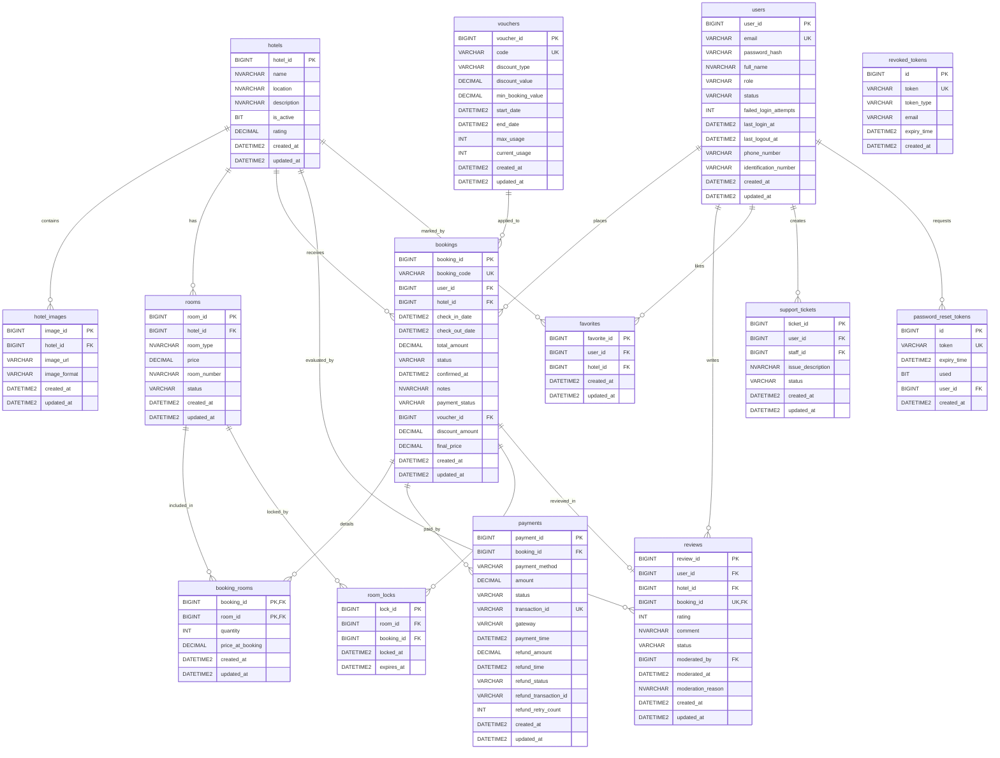

# Thiết kế & Đặc tả Cơ sở dữ liệu (Database Design Document)
**Dự án:** Hotel Booking System
**Hệ quản trị CSDL:** Microsoft SQL Server
**Trạng thái:** Hoàn chỉnh
**Phương pháp quản lý:** Flyway Database Migration (V1 - V12)

Tài liệu này cung cấp thiết kế chi tiết cơ sở dữ liệu của dự án Hotel Booking System, bao gồm sơ đồ quan hệ thực thể (ERD), cấu trúc chi tiết của từng bảng, danh sách các chỉ mục tối ưu hóa, và các ràng buộc toàn vẹn nghiệp vụ được thực thi ở mức cơ sở dữ liệu.

---

## 1. Sơ đồ Quan hệ Thực thể (Entity Relationship Diagram - ERD)

Dưới đây là sơ đồ quan hệ thực thể (ERD) thể hiện cấu trúc liên kết giữa các thực thể cốt lõi trong hệ thống:

---

## 2. Danh mục các Bảng Dữ liệu (Tables Inventory)

Hệ thống có tổng cộng **16 bảng** dữ liệu được khởi tạo và cập nhật qua các phiên bản di cư cấu trúc:

| STT | Tên Bảng (Table Name) | Phân hệ (Module) | Phiên bản (Flyway) | Vai trò & Mục đích |
| :---: | :--- | :--- | :---: | :--- |
| 1 | `users` | Authentication & Identity | V1, V2, V3 | Lưu thông tin định danh, vai trò, trạng thái tài khoản. |
| 2 | `hotels` | Inventory & Catalog | V1, V5 | Lưu trữ thông tin cơ bản và điểm đánh giá của khách sạn. |
| 3 | `hotel_images` | Inventory & Catalog | V1 | Lưu bộ sưu tập ảnh (galleries) của khách sạn. |
| 4 | `rooms` | Inventory & Catalog | V1, V5 | Lưu thông tin chi tiết các phòng thuộc khách sạn và trạng thái. |
| 5 | `bookings` | Booking Core | V1, V8, V9 | Hạt nhân lưu trữ trạng thái đặt phòng, check-in/out, giá trị đơn đặt. |
| 6 | `booking_rooms` | Booking Core | V1 | Bảng trung gian liên kết các phòng cụ thể được đặt trong đơn phòng. |
| 7 | `payments` | Payment & Billing | V1, V8, V9 | Lưu trữ thông tin giao dịch thanh toán và tiến trình hoàn tiền. |
| 8 | `reviews` | Reporting & Operations | V1, V10 | Lưu trữ đánh giá khách hàng (sao, bình luận) và log kiểm duyệt. |
| 9 | `favorites` | Search & Discovery | V1 | Lưu trữ danh sách khách sạn yêu thích của khách hàng. |
| 10 | `support_tickets` | Reporting & Operations | V1 | Lưu trữ yêu cầu hỗ trợ khách hàng và phân công nhân viên xử lý. |
| 11 | `login_audit_logs` | Authentication & Identity | V2 | Lưu vết lịch sử đăng nhập (IP, User-Agent, trạng thái). |
| 12 | `revoked_tokens` | Authentication & Identity | V2 | Danh sách đen JWT Access/Refresh tokens phục vụ đăng xuất. |
| 13 | `password_reset_tokens` | Authentication & Identity | V2 | Lưu mã OTP/Link token dùng cho khôi phục mật khẩu. |
| 14 | `room_locks` | Booking Core | V8 | Lưu thông tin tạm khóa phòng khi khách hàng đang thanh toán. |
| 15 | `vouchers` | Payment & Billing | V9 | Lưu các chương trình khuyến mãi, điều kiện áp dụng và giới hạn. |
| 16 | `payment_audit_logs` | Payment & Billing | V9 | Nhật ký audit API requests/responses đối tác thanh toán. |

---

## 3. Đặc tả Chi tiết cấu trúc từng Bảng (Detailed Table Schemas)

### 3.1. Bảng `users`
- **Mục đích:** Quản lý vòng đời tài khoản người dùng, phân quyền RBAC và thực thi khóa tài khoản khi nhập sai mật khẩu nhiều lần.

| Tên Cột (Column Name) | Kiểu Dữ Liệu | Ràng buộc (Constraints) | Mô tả / Ý nghĩa |
| :--- | :--- | :--- | :--- |
| `user_id` | BIGINT | PRIMARY KEY, IDENTITY(1,1) | Khóa chính tự tăng. |
| `email` | VARCHAR(255) | NOT NULL, UNIQUE | Địa chỉ email dùng để đăng nhập. |
| `password_hash` | VARCHAR(255) | NOT NULL | Mật khẩu băm bằng BCrypt (vòng lặp 12). |
| `full_name` | NVARCHAR(255) | NOT NULL | Tên đầy đủ hiển thị. |
| `role` | VARCHAR(50) | NOT NULL | Vai trò: `CUSTOMER`, `STAFF`, `ADMIN`, `DIRECTOR`, `RECEPTIONIST`, `HOUSEKEEPER`. |
| `status` | VARCHAR(50) | NOT NULL, DEFAULT 'ACTIVE' | Trạng thái: `ACTIVE`, `LOCKED`, `INACTIVE`. |
| `failed_login_attempts`| INT | NOT NULL, DEFAULT 0 | Số lần đăng nhập sai (tự động khóa nếu $\ge 5$). |
| `last_login_at` | DATETIME2 | NULL | Thời điểm đăng nhập thành công cuối cùng. |
| `last_logout_at` | DATETIME2 | NULL | Thời điểm gửi yêu cầu đăng xuất cuối cùng. |
| `phone_number` | VARCHAR(20) | NULL | Số điện thoại liên hệ (thêm ở V3). |
| `identification_number`| VARCHAR(50) | NULL | CMND/CCCD/Hộ chiếu khách hàng (thêm ở V3). |
| `created_at` | DATETIME2 | NOT NULL, DEFAULT GetDate() | Thời điểm tạo tài khoản. |
| `updated_at` | DATETIME2 | NOT NULL, DEFAULT GetDate() | Thời điểm cập nhật tài khoản gần nhất. |

### 3.2. Bảng `hotels`
- **Mục đích:** Lưu trữ danh sách khách sạn khả dụng trên hệ thống.

| Tên Cột (Column Name) | Kiểu Dữ Liệu | Ràng buộc (Constraints) | Mô tả / Ý nghĩa |
| :--- | :--- | :--- | :--- |
| `hotel_id` | BIGINT | PRIMARY KEY, IDENTITY(1,1) | Khóa chính tự tăng. |
| `name` | NVARCHAR(255) | NOT NULL | Tên của khách sạn. |
| `location` | NVARCHAR(MAX) | NOT NULL | Vị trí địa lý/địa chỉ khách sạn. |
| `description` | NVARCHAR(MAX) | NULL | Giới thiệu, mô tả chi tiết. |
| `is_active` | BIT | NOT NULL, DEFAULT 1 | 1: Active, 0: Soft Delete (Vô hiệu hóa). |
| `rating` | DECIMAL(3,2) | NULL | Điểm đánh giá trung bình từ 1.00 đến 5.00 (V5). |
| `created_at` | DATETIME2 | NOT NULL, DEFAULT GetDate() | Ngày tạo khách sạn. |
| `updated_at` | DATETIME2 | NOT NULL, DEFAULT GetDate() | Ngày cập nhật gần nhất. |

### 3.3. Bảng `hotel_images`
- **Mục đích:** Lưu trữ bộ sưu tập hình ảnh quảng bá của từng khách sạn.

| Tên Cột (Column Name) | Kiểu Dữ Liệu | Ràng buộc (Constraints) | Mô tả / Ý nghĩa |
| :--- | :--- | :--- | :--- |
| `image_id` | BIGINT | PRIMARY KEY, IDENTITY(1,1) | Khóa chính tự tăng. |
| `hotel_id` | BIGINT | NOT NULL, FK $\rightarrow$ `hotels` | Khóa ngoại liên kết tới khách sạn sở hữu ảnh. |
| `image_url` | VARCHAR(MAX) | NOT NULL | Đường dẫn URL hoặc folder lưu trữ ảnh. |
| `image_format` | VARCHAR(50) | NULL | Định dạng tệp tin ảnh: `jpg`, `png`, `webp`. |
| `created_at` | DATETIME2 | NOT NULL, DEFAULT GetDate() | Thời điểm tải lên. |
| `updated_at` | DATETIME2 | NOT NULL, DEFAULT GetDate() | Thời điểm cập nhật. |

### 3.4. Bảng `rooms`
- **Mục đích:** Quản lý kho phòng thực tế của từng khách sạn, kiểm soát giá và trạng thái bảo trì.

| Tên Cột (Column Name) | Kiểu Dữ Liệu | Ràng buộc (Constraints) | Mô tả / Ý nghĩa |
| :--- | :--- | :--- | :--- |
| `room_id` | BIGINT | PRIMARY KEY, IDENTITY(1,1) | Khóa chính tự tăng. |
| `hotel_id` | BIGINT | NOT NULL, FK $\rightarrow$ `hotels` | Khóa ngoại xác định phòng thuộc khách sạn nào. |
| `room_type` | NVARCHAR(100) | NOT NULL | Loại phòng (Deluxe, Standard, Suite...). |
| `price` | DECIMAL(18,2) | NOT NULL | Giá phòng cơ bản mỗi đêm. |
| `room_number` | NVARCHAR(50) | NOT NULL | Mã/Số phòng thực tế (ví dụ: 'Room 304'). |
| `status` | VARCHAR(50) | NOT NULL, DEFAULT 'AVAILABLE'| Trạng thái phòng: `AVAILABLE`, `UNAVAILABLE`, `MAINTENANCE` (V5). |
| `created_at` | DATETIME2 | NOT NULL, DEFAULT GetDate() | Thời điểm tạo phòng. |
| `updated_at` | DATETIME2 | NOT NULL, DEFAULT GetDate() | Thời điểm cập nhật phòng gần nhất. |

### 3.5. Bảng `bookings`
- **Mục đích:** Lưu trữ cốt lõi thông tin đặt phòng, theo dõi dòng doanh thu và tính toán giảm giá voucher.

| Tên Cột (Column Name) | Kiểu Dữ Liệu | Ràng buộc (Constraints) | Mô tả / Ý nghĩa |
| :--- | :--- | :--- | :--- |
| `booking_id` | BIGINT | PRIMARY KEY, IDENTITY(1,1) | Khóa chính tự tăng. |
| `booking_code` | VARCHAR(100) | NOT NULL, UNIQUE | Mã booking duy nhất sinh tự động (phục vụ đối soát). |
| `user_id` | BIGINT | NOT NULL, FK $\rightarrow$ `users` | Khóa ngoại liên kết khách hàng đặt phòng. |
| `hotel_id` | BIGINT | NOT NULL, FK $\rightarrow$ `hotels` | Khóa ngoại liên kết khách sạn được đặt. |
| `check_in_date` | DATETIME2 | NOT NULL | Ngày nhận phòng. |
| `check_out_date` | DATETIME2 | NOT NULL | Ngày trả phòng. |
| `total_amount` | DECIMAL(18,2) | NOT NULL | Tổng tiền gốc của đơn đặt phòng (chưa giảm giá). |
| `status` | VARCHAR(50) | NOT NULL | Trạng thái booking: `PENDING`, `CONFIRMED`, `CANCELLED`, `COMPLETED`. |
| `confirmed_at` | DATETIME2 | NULL | Thời điểm xác nhận thanh toán/đơn hàng thành công (V8). |
| `notes` | NVARCHAR(MAX) | NULL | Ghi chú thêm từ khách đặt phòng (V8). |
| `payment_status` | VARCHAR(50) | DEFAULT 'PENDING' | Trạng thái tiền: `PENDING`, `PAID`, `REFUNDED`, `FAILED` (V9). |
| `voucher_id` | BIGINT | NULL, FK $\rightarrow$ `vouchers` | Mã giảm giá được áp dụng vào booking này (V9). |
| `discount_amount` | DECIMAL(18,2) | DEFAULT 0 | Số tiền được giảm giá từ voucher (V9). |
| `final_price` | DECIMAL(18,2) | NOT NULL | Số tiền thanh toán cuối cùng khách phải trả (V9). |
| `created_at` | DATETIME2 | NOT NULL, DEFAULT GetDate() | Thời điểm tạo booking. |
| `updated_at` | DATETIME2 | NOT NULL, DEFAULT GetDate() | Thời điểm cập nhật đơn phòng gần nhất. |

### 3.6. Bảng `booking_rooms`
- **Mục đích:** Thực hiện chuẩn hóa cơ sở dữ liệu, liên kết danh sách các phòng được thuê trong một đơn đặt phòng.

| Tên Cột (Column Name) | Kiểu Dữ Liệu | Ràng buộc (Constraints) | Mô tả / Ý nghĩa |
| :--- | :--- | :--- | :--- |
| `booking_id` | BIGINT | PK, FK $\rightarrow$ `bookings` | Một phần của khóa chính ghép, liên kết đặt phòng. |
| `room_id` | BIGINT | PK, FK $\rightarrow$ `rooms` | Một phần của khóa chính ghép, liên kết phòng được thuê. |
| `quantity` | INT | NOT NULL, DEFAULT 1 | Số lượng phòng thuê. |
| `price_at_booking` | DECIMAL(18,2) | NOT NULL | Giá phòng thực tế ghi nhận tại thời điểm đặt phòng. |
| `created_at` | DATETIME2 | NOT NULL, DEFAULT GetDate() | Ngày ghi nhận. |
| `updated_at` | DATETIME2 | NOT NULL, DEFAULT GetDate() | Ngày cập nhật. |

### 3.7. Bảng `payments`
- **Mục đích:** Ghi nhận lịch sử giao dịch tài chính, trạng thái tích hợp cổng thanh toán trực tuyến, hoàn tiền và retry tự động.

| Tên Cột (Column Name) | Kiểu Dữ Liệu | Ràng buộc (Constraints) | Mô tả / Ý nghĩa |
| :--- | :--- | :--- | :--- |
| `payment_id` | BIGINT | PRIMARY KEY, IDENTITY(1,1) | Khóa chính tự tăng. |
| `booking_id` | BIGINT | NOT NULL, FK $\rightarrow$ `bookings` | Khóa ngoại liên kết đặt phòng tương ứng. |
| `payment_method` | VARCHAR(50) | NOT NULL | Phương thức: `ONLINE`, `CASH`, `BANK_TRANSFER`. |
| `amount` | DECIMAL(18,2) | NOT NULL | Số tiền thanh toán. |
| `status` | VARCHAR(50) | NOT NULL | Trạng thái giao dịch: `PENDING`, `SUCCESS`, `FAILED`, `REFUNDED`. |
| `transaction_id` | VARCHAR(255) | UNIQUE, NULL | Mã giao dịch đối tác gateway cung cấp (V8). |
| `gateway` | VARCHAR(50) | NULL | Tên cổng thanh toán: `VNPAY`, `MOMO`, `PAYPAL` (V9). |
| `payment_time` | DATETIME2 | NULL | Thời điểm thanh toán thành công (V9). |
| `refund_amount` | DECIMAL(18,2) | NULL | Số tiền hoàn trả cho khách hàng (V9). |
| `refund_time` | DATETIME2 | NULL | Thời điểm thực hiện hoàn tiền thành công (V9). |
| `refund_status` | VARCHAR(50) | NULL | Trạng thái hoàn tiền: `PENDING`, `SUCCESS`, `FAILED` (V9). |
| `refund_transaction_id`| VARCHAR(100) | NULL | Mã giao dịch hoàn tiền từ gateway đối tác (V9). |
| `refund_retry_count` | INT | DEFAULT 0 | Số lần tự động thử lại hoàn tiền khi gặp lỗi (V9). |
| `created_at` | DATETIME2 | NOT NULL, DEFAULT GetDate() | Ngày tạo giao dịch. |
| `updated_at` | DATETIME2 | NOT NULL, DEFAULT GetDate() | Ngày cập nhật gần nhất. |

### 3.8. Bảng `vouchers`
- **Mục đích:** Lưu trữ cấu hình mã giảm giá, kiểm soát thời gian áp dụng và tổng lượt sử dụng.

| Tên Cột (Column Name) | Kiểu Dữ Liệu | Ràng buộc (Constraints) | Mô tả / Ý nghĩa |
| :--- | :--- | :--- | :--- |
| `voucher_id` | BIGINT | PRIMARY KEY, IDENTITY(1,1) | Khóa chính tự tăng. |
| `code` | VARCHAR(50) | NOT NULL, UNIQUE | Mã giảm giá duy nhất (ví dụ: 'SALE30'). |
| `discount_type` | VARCHAR(20) | NOT NULL | Loại giảm giá: `PERCENTAGE` hoặc `FIXED_AMOUNT`. |
| `discount_value` | DECIMAL(18,2) | NOT NULL | Số phần trăm giảm hoặc số tiền cụ thể được giảm. |
| `min_booking_value` | DECIMAL(18,2) | DEFAULT 0 | Giá trị đơn đặt phòng tối thiểu để được dùng voucher. |
| `start_date` | DATETIME2 | NULL | Ngày bắt đầu có hiệu lực. |
| `end_date` | DATETIME2 | NULL | Ngày kết thúc hiệu lực của voucher. |
| `max_usage` | INT | DEFAULT 0 | Lượt dùng tối đa cho phép (0 là không giới hạn). |
| `current_usage` | INT | DEFAULT 0 | Tổng lượt thực tế đã được áp dụng thành công. |
| `created_at` | DATETIME2 | NOT NULL, DEFAULT GetDate() | Ngày tạo voucher. |
| `updated_at` | DATETIME2 | NOT NULL, DEFAULT GetDate() | Ngày cập nhật gần nhất. |

### 3.9. Bảng `room_locks`
- **Mục đích:** Tạm khóa phòng (giữ chỗ) trong tối đa 10 phút để người dùng hoàn tất quá trình thanh toán, ngăn ngừa tình trạng "Overbooking".

| Tên Cột (Column Name) | Kiểu Dữ Liệu | Ràng buộc (Constraints) | Mô tả / Ý nghĩa |
| :--- | :--- | :--- | :--- |
| `lock_id` | BIGINT | PRIMARY KEY, IDENTITY(1,1) | Khóa chính tự tăng. |
| `room_id` | BIGINT | NOT NULL, FK $\rightarrow$ `rooms` | Khóa ngoại chỉ định phòng đang bị tạm khóa. |
| `booking_id` | BIGINT | NOT NULL, FK $\rightarrow$ `bookings` | Khóa ngoại liên kết đơn đặt hàng tương ứng. |
| `locked_at` | DATETIME2 | NOT NULL, DEFAULT GetDate() | Thời điểm tạo khóa giữ phòng. |
| `expires_at` | DATETIME2 | NOT NULL | Thời điểm khóa giữ phòng tự động hết hiệu lực. |

### 3.10. Bảng `reviews`
- **Mục đích:** Lưu trữ đánh giá khách sạn của khách sau khi lưu trú, hỗ trợ Admin ẩn/hiện bình luận vi phạm chính sách.

| Tên Cột (Column Name) | Kiểu Dữ Liệu | Ràng buộc (Constraints) | Mô tả / Ý nghĩa |
| :--- | :--- | :--- | :--- |
| `review_id` | BIGINT | PRIMARY KEY, IDENTITY(1,1) | Khóa chính tự tăng. |
| `user_id` | BIGINT | NOT NULL, FK $\rightarrow$ `users` | Khóa ngoại liên kết người dùng gửi đánh giá. |
| `hotel_id` | BIGINT | NOT NULL, FK $\rightarrow$ `hotels` | Khóa ngoại chỉ định khách sạn nhận đánh giá. |
| `booking_id` | BIGINT | NOT NULL, UNIQUE, FK $\rightarrow$ `bookings` | Khóa ngoại duy nhất (đảm bảo 1 booking chỉ đánh giá 1 lần). |
| `rating` | INT | NOT NULL, CHECK (1 $\le$ rating $\le$ 5) | Điểm đánh giá (1 đến 5 sao). |
| `comment` | NVARCHAR(MAX) | NULL | Bình luận đánh giá chi tiết. |
| `status` | VARCHAR(20) | NOT NULL, DEFAULT 'VISIBLE' | Trạng thái: `VISIBLE`, `HIDDEN` (V10). |
| `moderated_by` | BIGINT | NULL, FK $\rightarrow$ `users` | Admin thực hiện ẩn/hiện đánh giá (V10). |
| `moderated_at` | DATETIME2 | NULL | Thời điểm thực hiện hành động kiểm duyệt (V10). |
| `moderation_reason` | NVARCHAR(500) | NULL | Lý do ẩn/xóa đánh giá (V10). |
| `created_at` | DATETIME2 | NOT NULL, DEFAULT GetDate() | Thời điểm gửi đánh giá. |
| `updated_at` | DATETIME2 | NOT NULL, DEFAULT GetDate() | Thời điểm cập nhật đánh giá gần nhất. |

### 3.11. Bảng `revoked_tokens` & `password_reset_tokens`
- **Mục đích:** Hỗ trợ bảo mật phiên làm việc và xác minh quy trình đặt lại mật khẩu.

#### `revoked_tokens`
- `id` (BIGINT, PRIMARY KEY, IDENTITY)
- `token` (VARCHAR(1000), NOT NULL, UNIQUE): Token bị thu hồi (JWT blacklist).
- `token_type` (VARCHAR(50), NOT NULL): `ACCESS` hoặc `REFRESH`.
- `email` (VARCHAR(255), NOT NULL)
- `expiry_time` (DATETIME2, NOT NULL): Thời điểm token hết hạn trong DB (trùng với hạn sử dụng JWT).

#### `password_reset_tokens`
- `id` (BIGINT, PRIMARY KEY, IDENTITY)
- `token` (VARCHAR(255), NOT NULL, UNIQUE): Mã token xác thực gửi cho người dùng.
- `expiry_time` (DATETIME2, NOT NULL): Hết hạn sau 5 phút kể từ lúc sinh.
- `used` (BIT, NOT NULL, DEFAULT 0): 1 nếu đã dùng để đổi mật khẩu, 0 nếu chưa dùng.
- `user_id` (BIGINT, NOT NULL, FK $\rightarrow$ `users`)

### 3.12. Bảng `favorites` & `support_tickets`
- **favorites:** Lưu trữ danh sách yêu thích (`favorite_id`, `user_id`, `hotel_id`).
- **support_tickets:** Quản lý yêu cầu hỗ trợ từ khách hàng (`ticket_id`, `user_id`, `staff_id` - nhân viên phản hồi, `issue_description`, `status`).

---

## 4. Thiết kế Chỉ mục Cơ sở dữ liệu (Database Indexes)

Để đáp ứng hiệu năng cao cho các nghiệp vụ tìm kiếm phòng trống real-time, bộ lọc khách sạn, xuất báo cáo tổng hợp và kiểm toán bảo mật, cơ sở dữ liệu được cấu hình các chỉ mục (Indexes) chuyên biệt sau:

| Tên Index | Bảng (Table) | Cột cấu thành (Columns) | Loại Index | Mục đích / Tối ưu hóa Nghiệp vụ |
| :--- | :--- | :--- | :--- | :--- |
| `idx_login_audit_logs_email` | `login_audit_logs` | `email` | Non-Unique | Truy vết lịch sử đăng nhập bảo mật của tài khoản. |
| `idx_revoked_tokens_token` | `revoked_tokens` | `token` | Non-Unique | Tối ưu hóa việc lọc token đen tại Spring Security Filter. |
| `idx_password_reset_tokens_token`| `password_reset_tokens`| `token` | Non-Unique | Kiểm tra nhanh token khôi phục mật khẩu. |
| `idx_rooms_hotel_status` | `rooms` | `hotel_id`, `status` | Non-Unique | **Tối ưu tìm kiếm phòng trống** theo khách sạn và trạng thái. |
| `idx_bookings_dates` | `bookings` | `check_in_date`, `check_out_date`| Non-Unique| **Tối ưu hóa range query** khi kiểm tra phòng trống trống lịch. |
| `idx_hotels_rating` | `hotels` | `rating` | Non-Unique | Tối ưu hóa bộ lọc sắp xếp khách sạn theo xếp hạng đánh giá. |
| `idx_room_locks_room_id` | `room_locks` | `room_id` | Non-Unique | Kiểm tra nhanh các khóa phòng đang tồn tại của phòng cụ thể. |
| `idx_room_locks_booking_id` | `room_locks` | `booking_id` | Non-Unique | Hủy nhanh toàn bộ khóa phòng thuộc một booking bị quá hạn. |
| `idx_vouchers_code` | `vouchers` | `code` | Non-Unique | Xác thực kiểm tra tồn tại và tính hợp lệ của mã giảm giá. |
| `idx_payments_transaction_id` | `payments` | `transaction_id` | **Unique, Partial**| Chống trùng lặp mã giao dịch từ cổng thanh toán (chỉ lọc cột khác NULL). |
| `idx_reviews_status` | `reviews` | `status` | Non-Unique | Tối ưu hóa việc hiển thị reviews lành mạnh cho khách xem. |
| `idx_bookings_created_at_status` | `bookings` | `created_at`, `status`| Non-Unique | **Tối ưu hóa báo cáo thống kê đặt phòng** theo khoảng ngày (V11). |
| `idx_payments_status_created_at` | `payments` | `status`, `created_at` | Non-Unique | **Tối ưu hóa báo cáo doanh thu** (V11) (Include `amount`, `booking_id`). |

---

## 5. Ràng buộc Toàn vẹn & Nghiệp vụ Cơ sở dữ liệu (Data Integrity Rules)

Để đảm bảo tính nhất quán của dữ liệu dưới áp lực truy cập đồng thời lớn, các quy tắc nghiệp vụ sau được cấu hình trực tiếp ở tầng dữ liệu:

1. **Khóa Ngoại Ràng Buộc Trực Tiếp:**
   - Tất cả các quan hệ 1-N đều có khóa ngoại.
   - Khi xóa Khách sạn (`hotels`), việc thực thi là **Soft Delete** (`is_active = 0`). Không sử dụng `ON DELETE CASCADE` trên bảng `hotels` để bảo vệ lịch sử giao dịch của `bookings` và `payments` trong quá khứ.
2. **Chống đánh giá trùng lặp:**
   - Bảng `reviews` thiết lập ràng buộc `UNIQUE` trên cột `booking_id`. Ràng buộc này đảm bảo một đơn đặt phòng chỉ được phép đánh giá một lần duy nhất.
3. **Giới hạn Thang điểm Đánh giá:**
   - Cột `rating` trong bảng `reviews` có ràng buộc kiểm tra giá trị (`CHECK CONSTRAINT`): `rating >= 1 AND rating <= 5`.
4. **Tránh giao dịch thanh toán trùng lặp:**
   - Thiết lập `UNIQUE INDEX` trên cột `transaction_id` của bảng `payments` với điều kiện `WHERE transaction_id IS NOT NULL`. Đảm bảo một mã giao dịch từ ngân hàng/cổng thanh toán chỉ được ghi nhận một lần duy nhất vào hệ thống.
5. **Đảm bảo tính nhất quán của lịch đặt phòng:**
   - Trạng thái khóa giữ phòng (`room_locks`) đảm bảo tính toàn vẹn thông qua đối chiếu thời gian. Mọi tác vụ chèn mới đơn phòng đều phải kiểm tra sự tồn tại của khóa phòng chưa hết hạn.

---

## 6. Lịch sử File Migration Flyway (Flyway Migration History)

Hệ thống quản lý lịch sử cấu trúc dữ liệu qua các script Flyway chạy tự động:

- **`V1__Init_database.sql`**: Tạo các bảng cơ bản của hệ thống (`users`, `hotels`, `hotel_images`, `rooms`, `bookings`, `booking_rooms`, `payments`, `reviews`, `favorites`, `support_tickets`) kèm theo các chỉ mục cơ bản.
- **`V2__Add_auth_tables_and_columns.sql`**: Thêm cột lịch sử đăng nhập/xuất vào `users`, tạo bảng `login_audit_logs`, `revoked_tokens`, `password_reset_tokens` và seed dữ liệu ban đầu cho tài khoản admin và customer mặc định.
- **`V3__Add_phone_and_identification.sql`**: Thêm thông tin liên lạc và giấy tờ cá nhân vào bảng `users`.
- **`V4__Seed_staff_user.sql`**: Seed dữ liệu cho nhân viên hệ thống mặc định.
- **`V5__Add_room_status_and_hotel_rating.sql`**: Thêm cột `status` cho phòng, cột `rating` cho khách sạn và tối ưu hóa các chỉ mục tìm kiếm phòng trống theo khoảng thời gian đặt.
- **`V6__Seed_hotels_and_rooms.sql`**: Cung cấp dữ liệu mẫu về các phòng và khách sạn phục vụ môi trường phát triển (development).
- **`V7__Seed_large_dataset.sql`**: Seed lượng dữ liệu mẫu lớn phục vụ kiểm thử hiệu năng.
- **`V8__Add_booking_and_payment_columns.sql`**: Tạo bảng `room_locks` thực thi tính năng tạm khóa giữ phòng và bổ sung các cột ghi nhận giao dịch đặt phòng.
- **`V9__Online_payment_and_voucher.sql`**: Tạo bảng `vouchers` phục vụ chương trình khuyến mãi, bổ sung các trường hoàn tiền và tạo bảng `payment_audit_logs` phục vụ đối soát giao dịch trực tuyến.
- **`V10__Review_moderation.sql`**: Thêm cột trạng thái kiểm duyệt (`status = VISIBLE/HIDDEN`) và lý do ẩn đánh giá vào bảng `reviews`.
- **`V11__Reporting_indexes.sql`**: Tạo các chỉ mục phức hợp tối ưu hóa hiệu năng truy vấn cho các báo cáo doanh thu và báo cáo thống kê phòng.
- **`V12__Seed_director_user.sql`**: Khởi tạo tài khoản giám đốc mặc định phục vụ chạy thử báo cáo doanh thu.
- **`V13__Seed_vouchers.sql`**: Khởi tạo danh sách mã giảm giá mẫu phục vụ thử nghiệm hệ thống.
- **`V14__Seed_more_vouchers.sql`**: Bổ sung các mã giảm giá đặc biệt.
- **`V15__Seed_receptionist_and_housekeeper_users.sql`**: Seed tài khoản nhân viên lễ tân (`RECEPTIONIST`) và buồng phòng (`HOUSEKEEPER`) phục vụ kiểm thử phân quyền mới.
