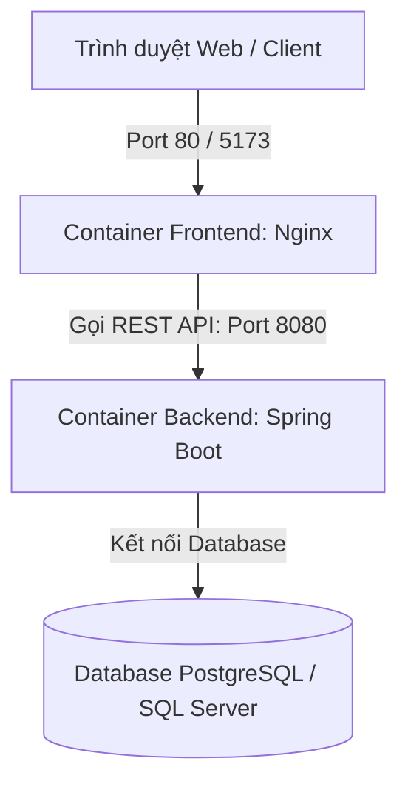

# Hướng dẫn Đóng gói và Triển khai với Docker (Docker Deployment Guide)
**Dự án:** Hotel Booking System
**Trạng thái:** Hoàn chỉnh
**Đường dẫn:** `docs/docker/docker_guide.md`

Tài liệu này hướng dẫn chi tiết cách cấu hình Dockerfile, vận hành hệ thống dưới local bằng Docker Compose, và cơ chế triển khai tự động (CI/CD) lên nền tảng Render thông qua Docker.

---

## 1. Kiến trúc Container hóa (Containerization Architecture)

Hệ thống được chia thành 2 Container độc lập chạy trong cùng một mạng ảo (Network):



- **Backend Container (`hotel-booking-backend`)**: Chạy ứng dụng Spring Boot trên nền Java 17 (JDK Eclipse Temurin). Port nội bộ `8080`.
- **Frontend Container (`hotel-booking-frontend`)**: Chạy Nginx để phục vụ mã nguồn React Vite sau khi đã build thành HTML/JS tĩnh. Port nội bộ `80`.

---

## 2. Chi tiết cấu hình các Dockerfile

### 2.1. Backend Dockerfile (Mục tiêu tối ưu hóa tài nguyên)
Được cấu hình bằng phương pháp **Multi-stage build** để giữ kích thước ảnh đích gọn nhẹ nhất và tận dụng bộ nhớ đệm (Docker Cache):

- **Stage 1 (Build Stage)**: Sử dụng Image `maven:3.9.6-eclipse-temurin-17` để tải các dependencies ngoại tuyến (`dependency:go-offline`) và đóng gói mã nguồn thành file `.jar` (`mvn package -DskipTests`).
- **Stage 2 (Run Stage)**: Chỉ sử dụng JRE gọn nhẹ `eclipse-temurin:17-jre-jammy` để chạy file `.jar` đã build.
- **Tối ưu hóa bộ nhớ cho Cloud Free (Render)**:
  - Sử dụng tham số chạy: `ENTRYPOINT ["java", "-Xmx320m", "-XX:+UseSerialGC", "-jar", "app.jar"]`
  - Giới hạn bộ nhớ Heap tối đa ở mức **320MB** và sử dụng **Serial Garbage Collector** giúp container hoạt động cực kỳ ổn định, không bao giờ bị tắt đột ngột do lỗi tràn bộ nhớ (Out-Of-Memory - Exit Code 137) trên các gói host miễn phí (thường giới hạn 512MB RAM).

### 2.2. Frontend Dockerfile (Vite + Nginx)
Cũng sử dụng **Multi-stage build**:
- **Stage 1 (Build Stage)**: Dùng `node:20-alpine`, thực hiện cài đặt thư viện (`npm ci`) và build ứng dụng Vite React thành thư mục `dist/` (`npm run build`).
- **Stage 2 (Serve Stage)**: Sử dụng Web Server siêu nhẹ `nginx:alpine`, sao chép thư mục `dist/` vào `/usr/share/nginx/html` để phục vụ trực tiếp qua giao thức HTTP (Port 80).

---

## 3. Cấu hình Docker Compose chạy Local

Tệp tin `docker-compose.yml` ở thư mục gốc phối hợp hoạt động của cả hai container:

```yaml
version: '3.8'

services:
  backend:
    build:
      context: .
      dockerfile: Dockerfile
    container_name: hotel-booking-backend
    ports:
      - "8080:8080"
    environment:
      - SPRING_PROFILES_ACTIVE=dev
      - DB_URL=jdbc:postgresql://<neon-db-url>/neondb?sslmode=require
      - DB_USERNAME=neondb_owner
      - DB_PASSWORD=your_db_password
      - JWT_SECRET=secure_jwt_secret_key_for_hotel_booking_system
    restart: always

  frontend:
    build:
      context: ./frontend
      dockerfile: Dockerfile
    container_name: hotel-booking-frontend
    ports:
      - "80:80"
      - "5173:80"
    depends_on:
      - backend
    restart: always
```

---

## 4. Hướng dẫn vận hành dưới local

Để khởi chạy hệ thống trên máy cá nhân, bạn thực hiện các lệnh sau tại thư mục gốc của dự án:

### 4.1. Khởi chạy toàn bộ hệ thống
Lệnh dưới đây sẽ tự động tải các base image, build source code của cả backend/frontend và khởi động các container:
```bash
docker compose up --build
```
*Sau khi chạy thành công:*
- Frontend truy cập tại: `http://localhost` hoặc `http://localhost:5173`
- Backend API truy cập tại: `http://localhost:8080/api/v1`

### 4.2. Chạy ngầm hệ thống (Detached Mode)
```bash
docker compose up -d
```

### 4.3. Dừng và xóa các Container đang chạy
```bash
docker compose down
```

### 4.4. Build lại một container cụ thể khi sửa code
```bash
# Build lại riêng frontend
docker compose build frontend

# Build lại riêng backend
docker compose build backend
```

---

## 5. Quy trình CI/CD và triển khai tự động lên Render

Dự án được thiết lập để tự động deploy (Continuous Deployment) lên nền tảng đám mây **Render** thông qua Docker:

1. **Liên kết Git**: Tạo dịch vụ Web Service trên Render và liên kết trực tiếp với kho mã nguồn GitHub của dự án.
2. **Cấu hình Web Service**:
   - Thiết lập **Environment** là `Docker`.
   - Chọn đường dẫn Dockerfile tương ứng (ví dụ: `Dockerfile` cho Backend Web Service và `frontend/Dockerfile` cho Frontend Web Service).
3. **Cơ chế kích hoạt (Trigger)**:
   - Mỗi khi có mã nguồn mới được push hoặc merge vào nhánh chính `main`, Render sẽ tự động kích hoạt tiến trình CI/CD:
     1. Kéo mã nguồn mới nhất về Server.
     2. Thực thi build Dockerfile tương ứng để đóng gói thành Docker Image mới.
     3. Khởi chạy container mới và tự động ngắt container cũ (Zero-Downtime Deployment).
4. **Biến môi trường**: Tất cả các thông tin bảo mật (như thông tin kết nối DB, JWT Secret) được cấu hình tập trung trong mục **Environment Variables** trên Dashboard Render, hoàn toàn không bị lộ thông tin dưới mã nguồn Git.
