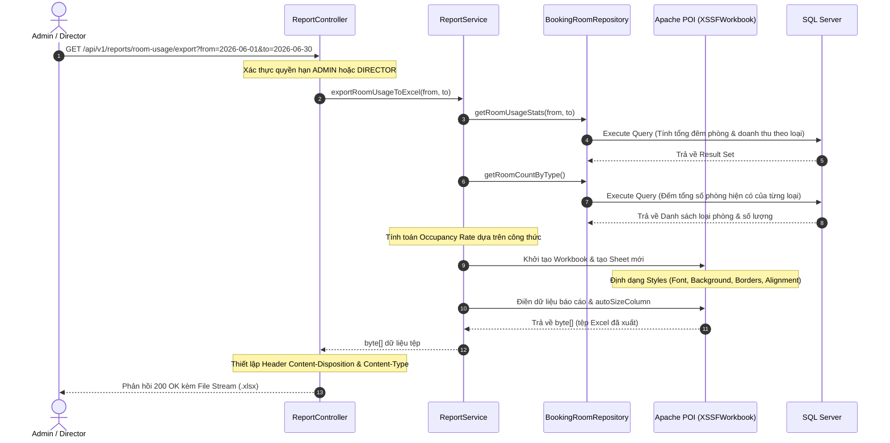

# Tài liệu Thiết kế Phân hệ Báo cáo & Thống kê (Reporting & Statistics Design Document)
**Dự án:** Hotel Booking System
**Phân hệ:** Báo cáo, Vận hành và Kiểm duyệt (Reporting, Operations & Moderation)
**Phiên bản:** 1.0.0 | **Ngày cập nhật:** 2026-06-22

Tài liệu này đặc tả chi tiết thiết kế logic, công thức tính toán, cấu trúc dữ liệu và đặc tả kỹ thuật của các tính năng báo cáo, thống kê và kiểm duyệt đánh giá thuộc hệ thống Đặt phòng Khách sạn.

---

## 1. Danh sách Use Cases trong Phân hệ

Phân hệ Báo cáo và Vận hành đáp ứng các yêu cầu nghiệp vụ cốt lõi sau:

| Mã UC | Tên Use Case | Actor chính | Mô tả chức năng | Hoạt động chính |
| :--- | :--- | :--- | :--- | :--- |
| **UC-24** | Xem thống kê đặt phòng | Admin | Báo cáo số lượng đơn đặt phòng theo trạng thái trong khoảng thời gian. | Tính tổng đơn, phân tích tỷ lệ % trạng thái (CONFIRMED, CANCELLED, PENDING), thống kê theo ngày. |
| **UC-25** | Xem báo cáo doanh thu | Director | Thống kê tổng doanh thu thực thu theo khoảng thời gian và khách sạn. | Doanh thu chỉ tính đơn thanh toán thành công (`SUCCESS/COMPLETED`), trừ đi tiền hoàn trả (refund). Hỗ trợ xem theo Ngày/Tháng/Quý/Năm. |
| **UC-26** | Xem hiệu suất phòng | Admin / Director | Thống kê hiệu suất sử dụng phòng (occupancy rate) thực tế. | Tính tỷ lệ phần trăm số đêm phòng được thuê so với tổng công suất phục vụ tối đa của loại phòng đó. |
| **UC-30** | Xuất Excel báo cáo phòng | Admin / Director | Tải file Excel báo cáo hiệu suất phòng trực tiếp về máy. | Sử dụng Apache POI sinh file `.xlsx` động trên bộ nhớ đệm và stream trực tiếp về client. Thời gian phản hồi $\le 5$ giây. |
| **UC-31** | Kiểm duyệt đánh giá | Admin | Kiểm duyệt, ẩn/hiện các đánh giá vi phạm tiêu chuẩn cộng đồng. | Admin ẩn review vi phạm $\rightarrow$ hệ thống lưu lý do và thông tin kiểm duyệt, đồng thời tự động cập nhật điểm đánh giá trung bình (`rating`) của khách sạn liên quan. |

---

## 2. Chi tiết Thiết kế & Logic Xử lý Nghiệp vụ

Phân hệ được cài đặt tại lớp [ReportServiceImpl.java](file:///C:/Users/Minmin/Documents/GitHub/hotel-booking-system/src/main/java/com/hotelbooking/service/impl/ReportServiceImpl.java). Dưới đây là logic chi tiết cho từng nghiệp vụ:

### 2.1. Thống kê Đặt phòng (UC-24)
*   **Tham số đầu vào:** `startDate` (LocalDate), `endDate` (LocalDate).
*   **Logic xử lý:**
    1.  Validate ngày bắt đầu không được lớn hơn ngày kết thúc.
    2.  Gọi `bookingRepository.countBookingsByStatus` để lấy số lượng đơn gom nhóm theo trạng thái (`PENDING`, `CONFIRMED`, `CANCELLED`, `FAILED`).
    3.  Tính toán tỷ lệ phần trăm (\%) của từng trạng thái làm tròn đến 2 chữ số thập phân:
        $$\text{Tỷ lệ \%} = \text{Round}\left(\frac{\text{Số đơn của trạng thái}}{\text{Tổng số đơn}} \times 100, 2\right)$$
    4.  Gọi `bookingRepository.findDailyStats` lấy số liệu biến động đặt phòng theo từng ngày trong khoảng thời gian đã chọn để vẽ biểu đồ ở Frontend.

### 2.2. Báo cáo Doanh thu (UC-25)
*   **Tham số đầu vào:** `startDate` (LocalDate), `endDate` (LocalDate), `period` ("DAY" | "MONTH" | "QUARTER" | "YEAR").
*   **Logic xử lý:**
    1.  Doanh thu thực tế được tính bằng tổng số tiền của các bản ghi `Payment` thành công (`SUCCESS/COMPLETED`) trừ các giao dịch hoàn tiền thành công (`REFUND_SUCCESS`).
    2.  Gọi `paymentRepository.sumRevenue` lấy tổng doanh thu toàn hệ thống.
    3.  Gọi `paymentRepository.findRevenueByHotel` để phân tích doanh thu đóng góp của từng khách sạn.
    4.  Gọi `paymentRepository.findDailyRevenue` lấy doanh thu hàng ngày, sau đó thực hiện gom nhóm động (Group by) trong bộ nhớ ứng dụng Java dựa trên tham số `period` để định dạng nhãn thời gian (ví dụ: `2026-Q2` cho Quý, `2026-06` cho Tháng).

### 2.3. Báo cáo Hiệu suất sử dụng phòng (UC-26)
*   **Công thức tính toán:**
    Hiệu suất phòng (Occupancy Rate) được tính dựa trên số đêm phòng thực tế được khách đặt chia cho tổng số đêm phòng tối đa có thể cung cấp (Tổng số phòng hiện có của loại phòng đó nhân với số ngày trong khoảng báo cáo).
    $$\text{Occupancy Rate (\%)} = \frac{\text{Tổng số đêm phòng đã được đặt (Total Nights)}}{\text{Tổng số phòng hiện có (Total Rooms)} \times \text{Số ngày trong kỳ báo cáo (Period Days)}} \times 100$$
*   **Ví dụ:** Loại phòng *Deluxe* có tổng cộng 10 phòng. Kỳ báo cáo kéo dài 30 ngày (tổng công suất là $10 \times 30 = 300$ đêm phòng). Nếu tổng số đêm đặt phòng thực tế là 150 đêm, tỷ lệ hiệu suất sẽ là:
    $$\text{Occupancy Rate} = \frac{150}{10 \times 30} \times 100 = 50\%$$

### 2.4. Xuất Báo cáo Excel động (UC-30)
*   **Thư viện sử dụng:** Apache POI (`XSSFWorkbook`, `Sheet`, `Row`, `Cell`).
*   **Quy trình xuất tệp:**
    1.  Lấy danh sách dữ liệu thống kê từ hàm nghiệp vụ `getRoomUsageReport`.
    2.  Khởi tạo `XSSFWorkbook` trên bộ nhớ đệm RAM.
    3.  Thiết lập `CellStyle` định dạng phông chữ, viền kẻ, màu nền (Sử dụng phông chữ đậm cho tiêu đề, căn lề phải cho cột số, định dạng kiểu hiển thị `%`).
    4.  Tạo dòng tiêu đề báo cáo và các dòng cột tiêu đề dữ liệu (Loại phòng, Tổng số phòng, Số đêm đặt, Số booking, Doanh thu (VND), Tỷ lệ sử dụng (%), Số ngày báo cáo).
    5.  Quét danh sách dữ liệu điền vào các ô tương ứng. Cấu hình tự động căn chỉnh độ rộng cột (`autoSizeColumn`).
    6.  Ghi workbook ra luồng Byte Array Output Stream (`ByteArrayOutputStream`).
    7.  Trả về mảng `byte[]` kèm theo Header HTTP để trình duyệt tự động kích hoạt tải xuống tệp tin:
        *   `Content-Disposition: attachment; filename="room-usage-yyyyMMdd-to-yyyyMMdd.xlsx"`
        *   `Content-Type: application/vnd.openxmlformats-officedocument.spreadsheetml.sheet`

### 2.5. Kiểm duyệt Đánh giá (UC-31)
*   **Quy trình nghiệp vụ:**
    1.  Admin duyệt danh sách đánh giá qua API `getReviewsForModeration`.
    2.  Khi phát hiện đánh giá không phù hợp, Admin gửi yêu cầu ẩn đánh giá kèm lý do (`action = HIDE`, `reason = ...`).
    3.  Hệ thống cập nhật trạng thái thực thể `Review`:
        *   `status` chuyển sang `HIDDEN`.
        *   Ghi vết thông tin kiểm duyệt: `moderatedBy = <admin_id>`, `moderatedAt = LocalDateTime.now()`, `moderationReason = <reason>`.
    4.  **Cập nhật tự động xếp hạng sao của khách sạn:** Kích hoạt lại việc tính toán điểm đánh giá trung bình (`rating`) của khách sạn chủ quản bằng cách lấy trung bình cộng số sao của các đánh giá có trạng thái `VISIBLE`. Loại bỏ các đánh giá có trạng thái `HIDDEN`.

---

## 3. Kiến trúc Luồng Dữ liệu (Request-Response Lifecycle)

Biểu đồ tuần tự dưới đây thể hiện cách yêu cầu xuất báo cáo Excel (UC-30) được xử lý xuyên suốt qua các tầng của hệ thống:



---

## 4. Đặc tả Cơ sở Dữ liệu & Các Truy vấn Cốt lõi

Các bảng chính liên quan trực tiếp đến việc tính toán báo cáo bao gồm:
*   `bookings` (lưu trữ thời gian `check_in_date`, `check_out_date`, trạng thái đặt phòng `status`).
*   `booking_rooms` (bảng trung gian chứa liên kết đặt phòng - phòng và giá phòng tại thời điểm đặt).
*   `payments` (lưu trữ trạng thái giao dịch `status`, số tiền thanh toán `amount`, loại giao dịch).
*   `reviews` (lưu trữ điểm đánh giá `rating`, nội dung `comment`, trạng thái hiển thị `status` và vết kiểm duyệt).

### Các câu lệnh SQL/JPQL phức tạp được thiết kế trong Repositories:

#### 1. Thống kê tỷ lệ phòng trống / Hiệu suất sử dụng phòng (trong [BookingRoomRepository.java](file:///C:/Users/Minmin/Documents/GitHub/hotel-booking-system/src/main/java/com/hotelbooking/repository/BookingRoomRepository.java)):
```sql
-- Lấy tổng số đêm phòng được đặt thực tế và tổng doanh thu theo từng loại phòng
SELECT r.roomType, 
       SUM(DATEDIFF(day, b.checkInDate, b.checkOutDate)) as totalNights, 
       COUNT(DISTINCT b.bookingId) as totalBookings, 
       SUM(br.priceAtBooking * DATEDIFF(day, b.checkInDate, b.checkOutDate)) as totalRevenue
FROM BookingRoom br
JOIN br.booking b
JOIN br.room r
WHERE b.status = 'CONFIRMED' 
  AND b.checkInDate >= :startDate 
  AND b.checkOutDate <= :endDate
GROUP BY r.roomType
```

#### 2. Thống kê doanh thu theo khách sạn (trong [PaymentRepository.java](file:///C:/Users/Minmin/Documents/GitHub/hotel-booking-system/src/main/java/com/hotelbooking/repository/PaymentRepository.java)):
```sql
-- Tính tổng doanh thu thu thực tế gom nhóm theo khách sạn
SELECT new com.hotelbooking.dto.response.HotelRevenueDto(
            h.hotelId, 
            h.name, 
            SUM(p.amount))
FROM Payment p
JOIN p.booking b
JOIN b.hotel h
WHERE p.status = 'SUCCESS' 
  AND p.paymentTime BETWEEN :startDateTime AND :endDateTime
GROUP BY h.hotelId, h.name
```
