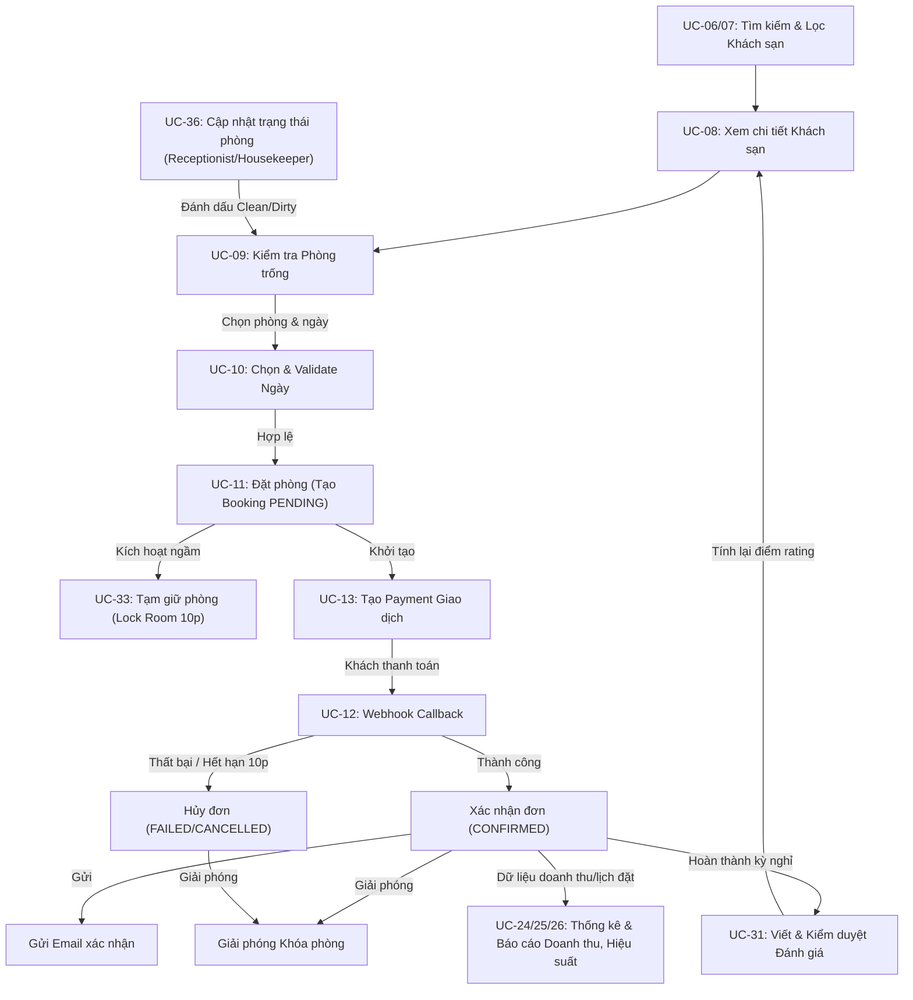

# Hướng dẫn Xác định và Giải trình Tính Liên kết giữa các Chức năng (Feature Integration & Dependency Guide)
**Dự án:** Hotel Booking System
**Mô hình tài liệu:** Đặc tả mối liên kết phục vụ Code Review

Trong một buổi review kiến trúc phần mềm, câu hỏi về **"Tính liên kết giữa các feature" (Feature Dependencies / Coupling)** là cực kỳ phổ biến. Hội đồng muốn biết các chức năng tương tác với nhau như thế nào, tính năng này làm tiền đề cho tính năng kia ra sao, và dữ liệu liên kết giữa chúng có nhất quán không.

Dưới đây là tài liệu hướng dẫn bạn cách xác định và trình bày mối liên kết này theo 3 cấp độ: **Luồng Nghiệp vụ (Business Flow)**, **Mối quan hệ dữ liệu (Database/Entity Relationship)** và **Sự phụ thuộc mã nguồn (Class Dependency)**.

---

## 1. Sơ đồ liên kết nghiệp vụ tổng thể (Feature Relationship Map)

Sơ đồ dưới đây thể hiện luồng đi của dữ liệu từ khi khách hàng tìm kiếm cho đến khi thanh toán, đánh giá và sinh báo cáo:

---

## 2. Giải trình 3 Cấp độ Liên kết (The 3 Levels of Integration)

Khi bị chất vấn trong buổi review, bạn hãy chia câu trả lời thành 3 cấp độ để thể hiện tư duy kiến trúc mạch lạc:

### Cấp độ 1: Liên kết theo Luồng Nghiệp vụ (Business Flow Dependency)
Các tính năng không hoạt động độc lập mà kế thừa kết quả của nhau theo chuỗi mắt xích:
1.  **Chuỗi Tìm kiếm - Đặt phòng:** Khách hàng không thể Đặt phòng (`UC-11`) nếu chưa đi qua luồng Tìm kiếm (`UC-06/07`), Xem phòng trống (`UC-09`) và Validate ngày (`UC-10`). Thông tin phòng trống hiển thị phải loại trừ các phòng đang bị khóa bởi tính năng `Room Lock` hoặc đang ở trạng thái bảo trì/chưa dọn dẹp (`UNAVAILABLE` do dọn phòng cập nhật qua `UC-36`).
2.  **Chuỗi Đặt phòng - Khóa phòng - Thanh toán (Core Transaction):** 
    *   Đặt phòng (`UC-11`) thành công sẽ tự động kích hoạt tính năng Tạm giữ phòng (`UC-33`) để khóa phòng trong 10 phút.
    *   Tính năng Thanh toán trực tuyến (`UC-13`) phụ thuộc vào đơn hàng đã tạo.
    *   Nếu thanh toán thành công, Webhook (`UC-12`) sẽ xác nhận đơn và tự động tắt khóa phòng. Nếu hết 10 phút chưa thanh toán, hệ thống tác vụ ngầm (`RoomLockCleanupScheduler`) sẽ tự động hủy đơn và mở khóa phòng.
3.  **Vòng lặp Đánh giá (Feedback Loop):** Đặt phòng thành công (`CONFIRMED`) và hoàn thành kỳ nghỉ (`COMPLETED`) là điều kiện cần để viết đánh giá. Đánh giá sau khi đăng hoặc kiểm duyệt (`UC-31`) sẽ tự động cập nhật lại số sao trung bình hiển thị tại trang Chi tiết khách sạn (`UC-08`), ảnh hưởng trực tiếp đến bộ lọc tìm kiếm theo đánh giá (`UC-07`).
4.  **Luồng Dọn dẹp phòng (Staff Operations Flow):** Khi khách check-out, lễ tân chuyển trạng thái phòng sang `UNAVAILABLE` (Bẩn). Nhân viên buồng phòng dọn dẹp xong cập nhật trạng thái phòng thành `AVAILABLE` (Sạch sẽ). Luồng này cập nhật trực tiếp vào trường `status` của bảng `rooms`, ngay lập tức đồng bộ với danh sách tìm kiếm phòng trống của khách hàng.
5.  **Luồng Dữ liệu Báo cáo (Analytical Flow):** Các báo cáo Doanh thu (`UC-25`), Thống kê đặt phòng (`UC-24`) và Hiệu suất phòng (`UC-26`) trực tiếp đọc dữ liệu lịch sử được kết xuất từ các đơn hàng thành công và các giao dịch thanh toán thành công.

### Cấp độ 2: Liên kết ở tầng Cơ sở dữ liệu (Database/Entity Relationships)
Tính liên kết thể hiện qua các ràng buộc khóa ngoại (Foreign Keys) giữa các Entity JPA:
*   `User` và `Hotel` là các thực thể gốc (Master Data).
*   `Room` liên kết với `Hotel` (`@ManyToOne` - Một khách sạn có nhiều phòng).
*   `Booking` liên kết với `User` và `Hotel` để xác định ai đặt ở đâu.
*   `BookingRoom` (Bảng trung gian) liên kết nhiều-nhiều giữa `Booking` và `Room` để biết đơn hàng gồm những phòng nào và lưu lại giá tại thời điểm đặt (`priceAtBooking`).
*   `RoomLock` liên kết với `Booking` và `Room` để giữ chỗ.
*   `Payment` liên kết trực tiếp với `Booking` để đối soát hóa đơn.
*   `Review` liên kết với `User`, `Hotel` và `Booking` (ràng buộc duy nhất `UNIQUE` trên `booking_id`).

### Cấp độ 3: Liên kết ở tầng Mã nguồn (Class Dependency / Java Collaboration)
Trong code Spring Boot, các lớp Service gọi lẫn nhau để hoàn thành nghiệp vụ phức tạp:
*   [BookingServiceImpl.java](file:///C:/Users/Minmin/Documents/GitHub/hotel-booking-system/src/main/java/com/hotelbooking/booking/BookingServiceImpl.java) phụ thuộc vào và gọi:
    *   `RoomLockService` để tạo khóa và giải phóng khóa phòng.
    *   `SystemSettingService` để lấy cấu hình thời gian khóa tự động (mặc định 10 phút).
    *   `PaymentRepository` để tạo bản ghi thanh toán.
*   [PaymentServiceImpl.java](file:///C:/Users/Minmin/Documents/GitHub/hotel-booking-system/src/main/java/com/hotelbooking/payment/PaymentServiceImpl.java) phụ thuộc vào và gọi:
    *   `EmailService` để gửi thư xác nhận đặt phòng khi nhận webhook thành công.
*   [ReviewServiceImpl.java](file:///C:/Users/Minmin/Documents/GitHub/hotel-booking-system/src/main/java/com/hotelbooking/hotel/ReviewServiceImpl.java) phụ thuộc vào:
    *   `BookingRepository` để xác thực quyền sở hữu và trạng thái `COMPLETED` của booking.
    *   `HotelRepository` để cập nhật lại điểm rating trung bình của khách sạn khi có đánh giá mới.
*   [ReportServiceImpl.java](file:///C:/Users/Minmin/Documents/GitHub/hotel-booking-system/src/main/java/com/hotelbooking/report/ReportServiceImpl.java) phụ thuộc vào nhiều repositories (`BookingRepository`, `PaymentRepository`, `ReviewRepository`) để tổng hợp dữ liệu chéo từ các phân hệ khác nhau.

---

## 3. Cách trả lời phỏng vấn thông minh (Review Tips)

*   **Nếu được hỏi:** *"Làm thế nào để các phân hệ không bị phụ thuộc quá chặt chẽ (tight coupling)?"*
*   **Cách trả lời:**
    > *"Chúng em thiết kế hệ thống theo nguyên tắc **Separation of Concerns (Tách biệt các mối quan tâm)**. Các lớp Controller chỉ chịu trách nhiệm nhận request, còn logic nghiệp vụ được đóng gói trong tầng Service.
    > 
    > Các Service liên kết với nhau qua các Interface. Ví dụ, `BookingServiceImpl` không trực tiếp can thiệp vào bảng `room_locks` mà gọi qua giao diện `RoomLockService`. 
    > 
    > Đối với các nghiệp vụ không cần đồng bộ (như gửi email xác nhận đặt phòng), chúng em thực hiện gọi bất đồng bộ hoặc tách biệt logic để không làm ảnh hưởng đến hiệu năng của luồng thanh toán chính."*
