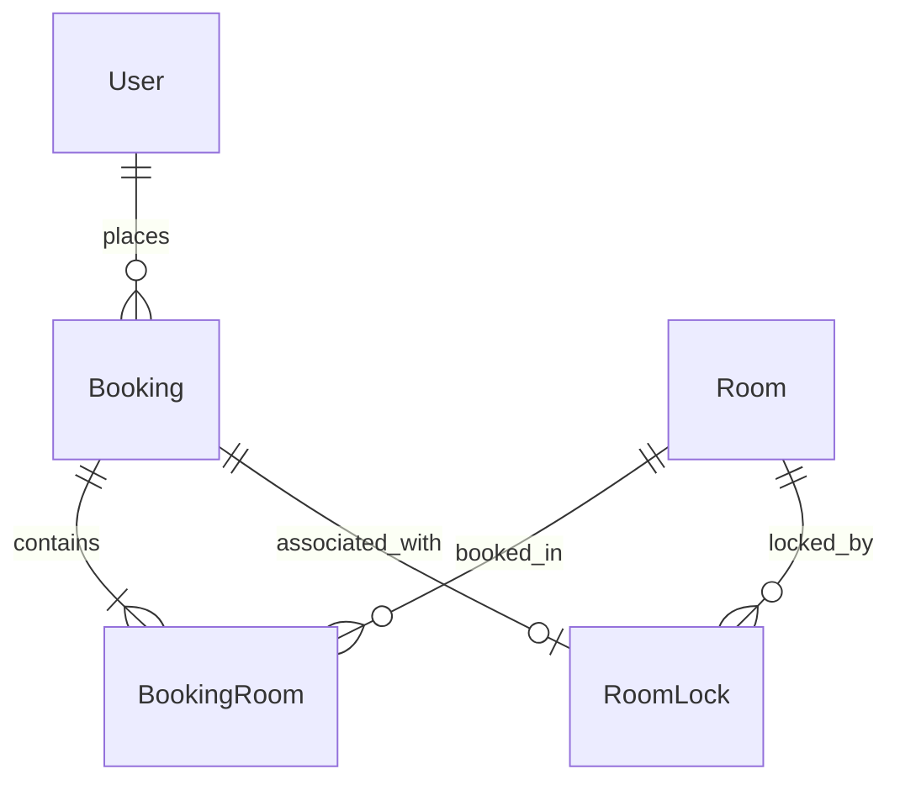

# Feature Specification: 003-booking-management

**Feature Branch**: `003-booking-management`  
**Created**: 2026-06-23  
**Status**: Completed  

---

## 1. Context & Goal
The booking system is the core transactional module of the Hotel Booking System. Its primary goal is to allow customers to search for available rooms and reserve them securely, while providing tools for receptionists and administrators to manage reservation lifecycles. 

To ensure inventory integrity under high concurrent requests, the system implements a temporary room-locking mechanism (Room Lock) during checkout, preventing double-bookings.

---

## 2. Actors & Roles
- **Customer**: Can search for available rooms, initiate booking requests, complete payments, and cancel their own bookings.
- **Receptionist**: Can manage all bookings, confirm offline payments, check guests in/out, and create/cancel bookings on behalf of guests.
- **Admin**: Has full administrative privileges, including managing bookings, overriding system settings (e.g., room lock durations), and accessing reports.
- **System**: Automatically monitors room locks, cleans up expired locks, updates booking states, and releases inventory.

---

## 3. Functional Requirements
- **FR-001**: Stay periods must be validated: check-in date >= today, check-out date > check-in date.
- **FR-002**: Room Lock duration must be configurable via settings (default 10 minutes).
- **FR-003**: System must use a cron-based scheduler (`RoomLockCleanupScheduler`) to release expired locks.
- **FR-004**: System must use database transactions with pessimistic locking to prevent concurrent bookings for the same room.

---

## 4. Non-functional Requirements
- **NFR-001 (Concurrency)**: The booking process must guarantee zero double-bookings under concurrent checkout requests for the same room.
- **NFR-002 (Performance)**: Booking status inquiries and creation requests must respond within 500ms under normal load conditions.
- **NFR-003 (Security)**: All REST endpoints under `/api/v1/bookings` (except room search and `/api/v1/bookings/validate-dates`) must require JWT authentication and enforce Role-Based Access Control (`CUSTOMER`, `RECEPTIONIST`, `STAFF`, `ADMIN`, `DIRECTOR`).
- **NFR-004 (Reliability)**: The `RoomLockCleanupScheduler` must execute every 1 minute to release expired locks, ensuring high availability of room inventory.

---

## 5. Data Model

### Key Entities
- **Booking**: Represents a reservation. Fields:
  - `bookingId` (Long, PK)
  - `bookingCode` (String, Unique)
  - `userId` (Long, FK)
  - `hotelId` (Long, FK)
  - `checkInDate` (Timestamp)
  - `checkOutDate` (Timestamp)
  - `totalAmount` (Decimal)
  - `status` (String: PENDING, CONFIRMED, CANCELLED, COMPLETED, FAILED)
  - `confirmedAt` (Timestamp)
  - `notes` (String)
  - `paymentStatus` (String)
  - `voucherId` (Long, FK, Nullable)
  - `discountAmount` (Decimal)
  - `finalPrice` (Decimal)
  - `createdAt` (Timestamp)
  - `updatedAt` (Timestamp)
- **BookingRoom**: Intermediate entity mapping bookings to rooms with historical price. Fields:
  - `bookingId` (Long, PK, FK)
  - `roomId` (Long, PK, FK)
  - `quantity` (Integer)
  - `priceAtBooking` (Decimal)
  - `createdAt` (Timestamp)
  - `updatedAt` (Timestamp)
- **RoomLock**: Represents temporary locks on rooms during payment processing. Fields:
  - `lockId` (Long, PK)
  - `roomId` (Long, FK)
  - `bookingId` (Long, FK)
  - `lockedAt` (Timestamp)
  - `expiresAt` (Timestamp)
- **SystemSetting**: Configured statically via application properties (e.g. `room.lock.duration-minutes` in settings, default 10 minutes) rather than a dynamic database table.


### Entity-Relationship Overview


---

## 6. Error Handling
All errors must be handled consistently by the `GlobalExceptionHandler` and return a standardized JSON structure. Stack traces and internal database messages must be hidden from client responses.

### Error Response Format
```json
{
  "timestamp": "2026-06-23T10:00:00Z",
  "status": 400,
  "error": "Bad Request",
  "message": "Check-out date must be after check-in date",
  "path": "/api/v1/bookings"
}
```

### Exception Mappings
| Exception Scenario | Throw Exception | HTTP Status | Error Message |
|---|---|---|---|
| Stay dates fail validation | `BusinessException` / `IllegalArgumentException` | 400 Bad Request | "Check-in date cannot be in the past" or "Check-out date must be after check-in date" |
| Room is already locked or booked | `BusinessException` | 400 Bad Request | "Room {roomNumber} is already booked for the selected dates" or "Room {roomNumber} is locked by another transaction" |
| Booking, Hotel, or Room ID not found | `ResourceNotFoundException` | 404 Not Found | "Resource not found with ID: {id}" / specific message |
| Unauthorized access | `AccessDeniedException` | 403 Forbidden | "Access is denied" |


---

## 7. Acceptance Criteria & User Scenarios

### User Story 1 - Create Booking & Validate Dates (Priority: P1)
As a Customer, I want to select check-in and check-out dates, validate availability, and book a room, so I can reserve my stay.

* **Why this priority**: Core transaction of the hotel booking system.
* **Independent Test**: Request `/api/v1/bookings` (POST) with valid room IDs and stay dates to successfully create a `PENDING` booking.
* **Acceptance Scenarios**:
  1. **Given** a customer selects stay dates, **When** check-in date is in the past, **Then** stay period validation via `/validate-dates` returns `valid: false` with an error message, and booking creation via POST `/api/v1/bookings` fails with 400 Bad Request.
  2. **Given** a customer books a room, **When** the room is currently available, **Then** a booking is created with status `PENDING`.
  3. **Given** a booking is created, **When** the payment process is initiated, **Then** the room is temporarily locked (Room Lock) for 10 minutes.

### User Story 2 - Confirm & Cancel Bookings (Priority: P1)
As a Customer, Receptionist, or Admin, I want to confirm, cancel, or process bookings to keep availability and check-in statuses accurate.

* **Why this priority**: Required to manage reservation lifecycles, handle offline/manual bookings, and trigger refund policies.
* **Independent Test**: Cancel a confirmed booking via `/api/v1/bookings/{id}/cancel` or process an offline booking via `/api/v1/admin/bookings/{id}/status`.
* **Acceptance Scenarios**:
  1. **Given** a `PENDING` booking, **When** payment succeeds or receptionist confirms offline payment, **Then** the booking status changes to `CONFIRMED`.
  2. **Given** a `CONFIRMED` booking, **When** cancelling before check-in, **Then** booking status changes to `CANCELLED` and refund is scheduled.
  3. **Given** a receptionist, **When** creating an offline booking for a guest, **Then** a booking is successfully created and managed under admin endpoints.

### User Story 3 - Room Lock & Automatic Release (Priority: P2)
As the System, I want to lock rooms during payment processing and automatically release them if payment fails or expires.

* **Why this priority**: Avoids double-booking (race conditions) during concurrent checkouts.
* **Independent Test**: Create a booking, wait for 10 minutes without payment, and verify that the scheduler releases the room lock and cancels the booking.
* **Acceptance Scenarios**:
  1. **Given** an active room lock of 10 minutes, **When** the scheduler runs after 10 minutes, **Then** the lock is deleted and the pending booking is marked `FAILED`.

### Success Criteria
- **SC-001**: Clean validation rules fail with a 400 Bad Request error.
- **SC-002**: Zero double bookings under concurrent checkout requests.

---

## 8. Out of Scope
- Third-party payment gateway integration details (handled separately under `004-payment-billing`).
- Automated notification dispatching (SMS/Email alerts) upon booking confirmation or cancellation.
- Room upgrades, swapping rooms within an active booking, or post-booking guest modifications.
