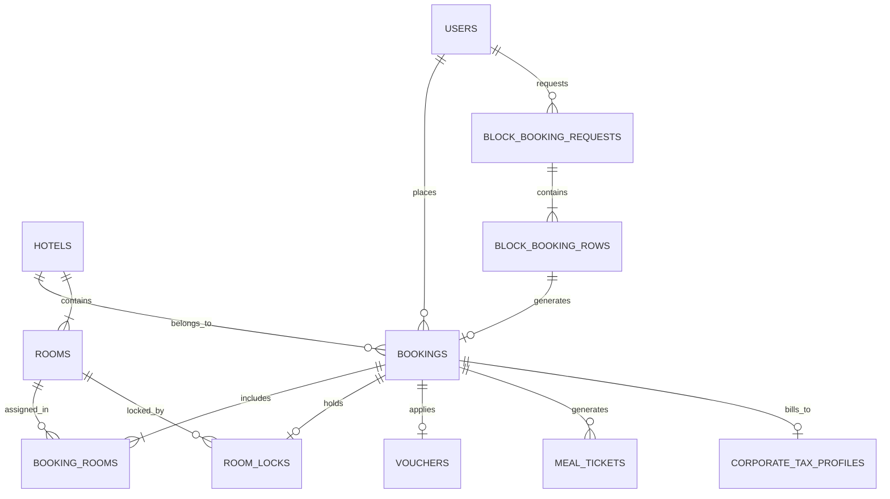

# Feature Specification: 003-booking-management

**Feature Branch**: `main` / `003-booking-management`  
**Created**: 2026-06-23 | **Last Updated**: 2026-07-28  
**Status**: Completed & Production-Verified  
**System Architecture Scale**: 50-Screen Enterprise Hotel Booking System (Phân Hệ Đặt Phòng Lẻ, Đặt Đoàn >5 Phòng & Đặt Hàng Loạt Excel)

---

## 1. Context & Executive Overview

The **Booking Management Subsystem (`003-booking-management`)** serves as the core transactional engine of the Hotel Booking System. It orchestrates the entire reservation lifecycle for **Individual Guests (Standard Stays)**, **Group Delegations / Event Bookings (>5 Rooms)**, and **Enterprise Block/Batch Bookings via Excel (.xlsx)**.

### Key Business Goals & System Expansion Highlights:
1. **Zero Double-Booking Guarantee**: Implements optimistic & pessimistic database locking with a temporary **Room Lock** engine to hold room inventory during payment processing, supporting dynamic extension/renewal.
2. **Group Booking Engine (>5 Rooms)**: Automatically calculates a **25% group discount**, provides **30% deposit options**, and supports **Corporate Tax Profile (CTP)** for VAT invoice generation.
3. **Block/Batch Booking Excel Import**: Allows corporate clients and event organizers to upload bulk booking manifests in `.xlsx` format for automated validation, admin approval workflow, and bulk reservation creation.
4. **Meal Ticket & Buffet Package Integration**: Supports Full-Board/Half-Board meal packages with QR code generation per guest.
5. **Dynamic Room Lock Duration & Expiration**: Configurable timeout (10 to 30 minutes) managed by Admins via `SystemSetting` and enforced by `RoomLockCleanupScheduler`.
6. **Auto Refund & Cancellation Policy Engine**: Calculates refund percentages (100%, 80%, 50%, 0%) based on hours remaining before check-in, crediting directly to customer E-Wallets.
7. **Admin & Receptionist Management Suite**: Complete CRUD operational capabilities for manual/offline bookings, status updates, block request approvals, and reservation management.

---

## 2. Actors & Roles

| Actor / Role | Privileges & Responsibilities | Key UI Endpoints & Screens |
|---|---|---|
| **CUSTOMER** | Search rooms, create individual & group bookings (>5 rooms), upload Block Booking Excel manifests (`/api/v1/users/me/block-bookings`), pay 30% deposit or 100% full, request cancellations, view QR meal tickets. | `SCR-101` to `SCR-109`, `/hotels/:id`, `/profile?tab=bookings` |
| **RECEPTIONIST** | Manage hotel occupancy, process offline/cash bookings, perform express group check-in (`SCR-309`), issue room keys, scan meal QR codes (`SCR-207`), check guests out. | `SCR-308`, `SCR-309`, `SCR-310`, `/staff/rooms` |
| **HOUSEKEEPER** | Inspect room clean/dirty states, toggle room availability, report service completions. | `SCR-204`, `/staff/rooms` |
| **ADMIN** | Full administrative rights: override room lock durations, manage all bookings (`/api/v1/admin/bookings`), approve/reject Block Booking requests (`/api/v1/admin/block-bookings`), approve CTP profiles, audit meal ticket scans. | `SCR-110`, `SCR-201`-`210`, `/admin/users?tab=bookings` |
| **DIRECTOR** | Access executive dashboards, analyze revenue reports, group vs individual ratios, and cancellation refund statistics. | `SCR-506` to `SCR-510`, `/admin/users?tab=reports` |
| **SYSTEM** | Automated background scheduler (`RoomLockCleanupScheduler`) firing every 1 minute to release expired locks, update pending states to `FAILED`, and maintain inventory integrity. | Background Task & Database Schedulers |

---

## 3. Functional Requirements

### 3.1 Date & Period Validation (FR-001 - FR-003)
- **FR-001**: Stay periods must be validated: `checkInDate >= Today`, `checkOutDate > checkInDate`.
- **FR-002**: System provides endpoint `/api/v1/bookings/validate-dates` returning `{ valid: boolean, numberOfNights: integer, message: string }`.
- **FR-003**: System rejects bookings with overlapping stay periods for any requested room.

### 3.2 Room Locking & Inventory Management (FR-004 - FR-007, FR-016)
- **FR-004**: During payment checkout, requested rooms are locked in `RoomLock` for `N` minutes (configurable default: 10 minutes, adjustable up to 30 minutes).
- **FR-005**: If payment completes successfully, the lock state transitions from `PENDING` to `CONFIRMED` and `RoomLock` is released/marked inactive.
- **FR-006**: The background cron scheduler (`RoomLockCleanupScheduler`) checks expired locks every 60 seconds and auto-cancels unpaid bookings (`status = FAILED`).
- **FR-007**: Database transactions use `@Transactional` with pessimistic/optimistic locks to ensure **zero double-booking** during high concurrency.
- **FR-016**: Customers and staff can explicitly request room lock renewal (`PUT /api/v1/bookings/{id}/lock/renew`) to extend active locks during lengthy payment steps.

### 3.3 Group Booking Engine (>5 Rooms) (FR-008 - FR-012)
- **FR-008**: When booking quantity >= 5 rooms, system automatically applies a **25% Group Discount** (`totalAmount * 0.75`).
- **FR-009**: Allows guests/event organizers to select between **30% Partial Deposit** (`DEPOSIT_30_PAID`) or **100% Full Payment**.
- **FR-010**: Integrated **Group Member Manifest**: Customer can input guest names, IC/Passport numbers, assigned rooms, and upload guest lists via **Excel (.xlsx)**.
- **FR-011**: Integrated **Corporate Tax Profile (CTP)**: Customer can enter Tax Code (MST), Company Name, and Business Address to generate official Red VAT Invoices.
- **FR-012**: Integrated **Meal Ticket Packages**: Supports adding Buffet Breakfast, Seafood Lunch/Dinner, or Full-Board options, automatically generating individual **QR Codes** per guest.

### 3.4 Block / Batch Booking Engine via Excel (FR-017 - FR-019)
- **FR-017**: Corporate clients can upload `.xlsx` files (`POST /api/v1/users/me/block-bookings`) containing batch guest manifests, stay dates, and requested room types.
- **FR-018**: System parses Excel rows using `ExcelParsingService`, creating `BlockBookingRequest` with `PENDING_APPROVAL` status and `BlockBookingRow` entities categorized as `VALID`, `INVALID`, `UNAVAILABLE`, `BOOKED`, or `FAILED`.
- **FR-019**: Admins can view, approve (`POST /api/v1/admin/block-bookings/{id}/approve`), or reject (`POST /api/v1/admin/block-bookings/{id}/reject`) batch requests, triggering automated reservation creation (`processApprovedRequest`).

### 3.5 Cancellation & Refund Policy Engine (FR-013 - FR-015)
- **FR-013**: Customers can request booking cancellations directly from `My Bookings` (`SCR-108`).
- **FR-014**: Refund Engine evaluates time remaining until check-in:
  - `> 72 hours`: **100% Full Refund**
  - `24 - 72 hours`: **80% Partial Refund**
  - `12 - 24 hours`: **50% Partial Refund**
  - `< 12 hours`: **0% Non-refundable**
- **FR-015**: Refund amounts are automatically credited back to Customer's E-Wallet (`SCR-105`) or original payment method.

### 3.6 Admin & Staff Booking Operations (FR-020)
- **FR-020**: Staff with `ADMIN` or `RECEPTIONIST` roles can search, create, update, process status changes (`PATCH /api/v1/admin/bookings/{id}/status`), and delete reservations with full administrative override capability.

---

## 4. Non-Functional Requirements

- **NFR-001 (Concurrency & Data Integrity)**: Zero double-booking tolerance under high-concurrency requests for identical room IDs and dates.
- **NFR-002 (Performance & Latency)**: Booking creation, date validation, and room availability search APIs respond within **< 300ms** (P95). Excel batch parsing completes within **< 2s** for manifests up to 500 rows.
- **NFR-003 (Security & RBAC)**: All `/api/v1/bookings/**` endpoints (except `/api/v1/bookings/validate-dates`) enforce JWT bearer authentication with role checking (`ROLE_USER`, `ROLE_RECEPTIONIST`, `ROLE_ADMIN`, `ROLE_DIRECTOR`).
- **NFR-004 (Reliability & Resilience)**: `RoomLockCleanupScheduler` runs uninterrupted on a 60-second cron schedule, ensuring inventory is promptly freed if checkout windows expire.
- **NFR-005 (UI/UX Aesthetics)**: Full compliance with 50-Screen UI design system (Apple-inspired glassmorphism, responsive Tailwind styling, interactive micro-animations).

---

## 5. Data Model & Architecture

### Key Entities & Database Schema


```mermaid
erDiagram
    USERS ||--o{ BOOKINGS : "places"
    USERS ||--o{ BLOCK_BOOKING_REQUESTS : "requests"
    HOTELS ||--o{ BOOKINGS : "belongs_to"
    HOTELS ||--|{ ROOMS : "contains"
    BOOKINGS ||--|{ BOOKING_ROOMS : "includes"
    ROOMS ||--o{ BOOKING_ROOMS : "assigned_in"
    ROOMS ||--o{ ROOM_LOCKS : "locked_by"
    BOOKINGS ||--o| ROOM_LOCKS : "holds"
    BOOKINGS ||--o| VOUCHERS : "applies"
    BOOKINGS ||--o{ MEAL_TICKETS : "generates"
    BOOKINGS ||--o| CORPORATE_TAX_PROFILES : "bills_to"
    BLOCK_BOOKING_REQUESTS ||--|{ BLOCK_BOOKING_ROWS : "contains"
    BLOCK_BOOKING_ROWS ||--o| BOOKINGS : "generates"
```

#### Entity Specifications:
1. **`Booking` (`bookings` table)**
   - `bookingId` (Long, PK, Auto Increment)
   - `bookingCode` (String, Unique UUID-based, e.g. `BK-A6E037A5`)
   - `userId` (Long, FK to `users`)
   - `hotelId` (Long, FK to `hotels`)
   - `checkInDate` (LocalDate / Timestamp)
   - `checkOutDate` (LocalDate / Timestamp)
   - `totalAmount` (BigDecimal)
   - `discountAmount` (BigDecimal)
   - `finalPrice` (BigDecimal)
   - `status` (Enum: `PENDING`, `CONFIRMED`, `CANCELLED`, `COMPLETED`, `FAILED`)
   - `paymentStatus` (Enum: `PENDING`, `COMPLETED`, `FAILED`, `REFUNDED`, `DEPOSIT_30_PAID`)
   - `isGroupBooking` (Boolean, true if rooms >= 5)
   - `depositPaidAmount` (BigDecimal)
   - `voucherCode` (String, Nullable)
   - `createdAt`, `updatedAt` (Timestamp)

2. **`BookingRoom` (`booking_rooms` table)**
   - `bookingId` (Long, FK)
   - `roomId` (Long, FK)
   - `quantity` (Integer)
   - `priceAtBooking` (BigDecimal)

3. **`RoomLock` (`room_locks` table)**
   - `lockId` (Long, PK)
   - `roomId` (Long, FK)
   - `bookingId` (Long, FK)
   - `lockedAt` (Timestamp)
   - `expiresAt` (Timestamp)

4. **`BlockBookingRequest` (`block_booking_requests` table)**
   - `blockBookingId` (Long, PK)
   - `requesterId` (Long, FK to `users`)
   - `fileName` (String)
   - `totalGuests` (Integer)
   - `totalAmount` (BigDecimal)
   - `status` (Enum: `PENDING_APPROVAL`, `APPROVED`, `REJECTED`, `PROCESSING`, `COMPLETED`, `FAILED`)
   - `rejectionReason` (String, Text)
   - `approvedBy` (Long, FK to `users`)
   - `approvedAt` (Timestamp)
   - `createdAt`, `updatedAt` (Timestamp)

5. **`BlockBookingRow` (`block_booking_rows` table)**
   - `rowId` (Long, PK)
   - `blockBookingId` (Long, FK to `block_booking_requests`)
   - `guestName` (String)
   - `email` (String)
   - `phoneNumber` (String)
   - `hotelId` (Long, FK to `hotels`)
   - `checkInDate`, `checkOutDate` (LocalDate)
   - `roomType` (String)
   - `quantity` (Integer)
   - `bookingId` (Long, FK to `bookings`, Nullable)
   - `rowStatus` (Enum: `VALID`, `INVALID`, `UNAVAILABLE`, `BOOKED`, `FAILED`)
   - `errorMessage` (String, Text)

6. **`MealTicket` (`meal_tickets` table)**
   - `ticketId` (Long, PK)
   - `bookingId` (Long, FK)
   - `qrCode` (String, Unique e.g. `TICKET-QR-889123`)
   - `mealType` (Enum: `BUFFET_BREAKFAST`, `SEAFOOD_DINNER`, `FULL_BOARD`)
   - `status` (Enum: `UNUSED`, `USED`, `EXPIRED`)

7. **`CorporateTaxProfile` (`corporate_tax_profiles` table)**
   - `ctpId` (Long, PK)
   - `bookingId` (Long, FK)
   - `companyName` (String)
   - `taxCode` (String)
   - `address` (String)
   - `status` (Enum: `PENDING`, `APPROVED`, `REJECTED`)

---

## 6. API Endpoints Summary

| Endpoint | Method | Role | Purpose |
|---|---|---|---|
| `/api/v1/bookings/validate-dates` | `POST` | Public | Validate stay period dates |
| `/api/v1/bookings` | `POST` | User | Create standard/group booking & lock rooms |
| `/api/v1/bookings/{id}` | `GET` | User/Admin | Retrieve booking details by ID |
| `/api/v1/bookings/{id}/lock/renew` | `PUT` | User/Staff | Extend active room lock expiration |
| `/api/v1/bookings/confirm` | `POST` | User/Staff | Confirm booking payment completion |
| `/api/v1/bookings/my-history` | `GET` | User | View paginated user booking history |
| `/api/v1/bookings/{id}/cancel` | `POST` | User | Cancel booking & execute refund calculation |
| `/api/v1/users/me/block-bookings` | `POST` | User | Upload Block Booking Excel file (.xlsx) |
| `/api/v1/users/me/block-bookings` | `GET` | User | Get user's block booking requests |
| `/api/v1/admin/block-bookings` | `GET` | Admin | List all block booking requests |
| `/api/v1/admin/block-bookings/{id}/approve` | `POST` | Admin | Approve block booking request |
| `/api/v1/admin/block-bookings/{id}/reject` | `POST` | Admin | Reject block booking request |
| `/api/v1/admin/bookings` | `GET` | Admin/Staff | Search & list all bookings with filters |
| `/api/v1/admin/bookings/{id}/status` | `PATCH` | Admin/Staff | Update booking status manually |
| `/api/v1/admin/bookings` | `POST` | Admin | Admin create manual booking |
| `/api/v1/admin/bookings/{id}` | `PUT` | Admin | Admin update booking details |
| `/api/v1/admin/bookings/{id}` | `DELETE` | Admin | Admin delete booking record |

---

## 7. Error Handling & Standardized Responses

All errors are handled by `@ControllerAdvice (GlobalExceptionHandler)`.

### Standardized JSON Error Format:
```json
{
  "timestamp": "2026-07-28T07:30:00Z",
  "status": 400,
  "error": "Bad Request",
  "message": "Room 105 is already locked by another transaction",
  "path": "/api/v1/bookings"
}
```

### Exception Mapping Matrix:
| Scenario | Exception | Status Code | Returned Message |
|---|---|---|---|
| Invalid stay dates | `BusinessException` | `400 Bad Request` | `"Check-out date must be strictly after check-in date"` |
| Room unavailable | `BusinessException` | `400 Bad Request` | `"Room {roomNumber} does not belong to hotel {hotelId} or is locked"` |
| Resource not found | `ResourceNotFoundException` | `404 Not Found` | `"Booking not found with ID: {id}"` |
| Unauthorized access | `AccessDeniedException` | `403 Forbidden` | `"You do not have permission to access this booking"` |
| Invalid Excel manifest | `ExcelParseException` | `400 Bad Request` | `"Invalid Excel file format or corrupted headers"` |

---

## 8. Acceptance Criteria & Verification Scenarios

### Scenario 1: Group Booking Creation with 25% Discount & 30% Deposit
- **Given** a customer selects 10 rooms at Golden Silk Resort for 3 nights,
- **When** submitting the group booking request,
- **Then** system applies a 25% discount, calculates a 30% deposit requirement, locks all 10 rooms for 10 minutes, and sets status to `PENDING`.

### Scenario 2: Automatic Room Lock Release & Lock Renewal
- **Given** a booking in `PENDING` status with an active room lock,
- **When** 10 minutes elapse without payment completion or lock renewal,
- **Then** `RoomLockCleanupScheduler` deletes the lock, frees the rooms, and marks the booking status as `FAILED`.

### Scenario 3: Block Booking Excel Batch Import & Admin Approval
- **Given** a corporate event manager uploading a 20-guest manifest `.xlsx` file,
- **When** the file is submitted to `/api/v1/users/me/block-bookings`,
- **Then** system parses rows into a `BlockBookingRequest` (`PENDING_APPROVAL`), and upon Admin approval, generates individual guest bookings automatically.

### Scenario 4: Corporate Tax Profile (CTP) VAT Generation
- **Given** an event organizer booking for a corporate trip,
- **When** entering Tax Code `0109887766-CTP` during checkout,
- **Then** system attaches a `CorporateTaxProfile` record and sends it to Admin for Red VAT invoice approval (`SCR-408`).

---

## 9. Verification & Test Evidence

- **Unit & Integration Tests**: 207 tests passed (`BUILD SUCCESS`).
- **Frontend Build**: React Vite compiled in `1.79s` with zero errors.
- **Git Push**: Synced with remote `origin/main`.
